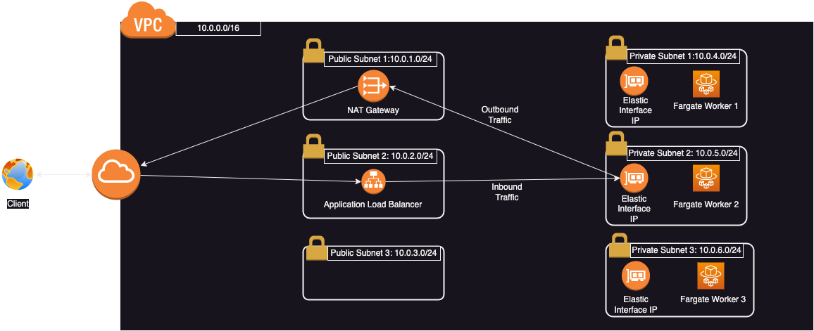
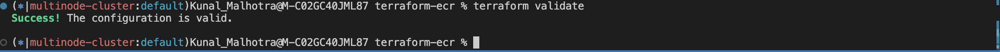

# Blockchain-client
A simple polygon client written in golang deployed on AWS ECS Fargate

## AWS Architecture


- Multi-zone AWS deployment for resilience, scalability and availability
- Proper security group are in place for block unwanted traffic.
- Controlled outbound and inbound traffic.

## How to run the application

- Step 1: cd in terraform-ecr dir and run the following commands give below Terraform code will build an AWS ECR repo and push the application docker image to it.
```
terraform init #To initalize and download all the required providers locally
terraform validate
terraform plan #To see what terraform is going to build
terraform apply #Terrform build the infrastructure
```
- Step 2: cd in terraform-ecs dir. Terraform code will create the necessary infrastructure for the docker image to run i.e AWS VPC,AWS ECS cluster, AWS fargate task and service.
```
terraform init #To initalize and download all the required providers locally
terraform validate
terraform plan #To see what terraform is going to build
terraform apply #Terrform build the infrastructure
```
- Step 3: Using the dns provided by AWS alb, hit the root endpoint.
- Step 4: You can test the go application manually too via running the command
```
go build -o main
./main
curl http://localhost:3000/
```
## Response recevied when the endpoint is hit
- Request 1
```
Server have started on port 3000
200 OK
{"jsonrpc":"2.0","id":2,"result":"0x29422ae"}
```
- Request 2
```
200 OK
{"id":2,"jsonrpc":"2.0","result":{"difficulty":"0xd","extraData":"0xd682020983626f7288676f312e31372e32856c696e75780000000000000000004a21925484239cd04672b6d86c9ea2737851a8f87bdb783ee101c830ddcc142018cc108524fb3708a4e7cf82769569b2d8af1e6be85b640d313af8151f2d30c401","gasLimit":"0x1312d00","gasUsed":"0xe13554","hash":"0xe1efb3e3e0e76e7578a6c9216755bf25d22cb0c43dff9aff4f62de507e846d4f","logsBloom":"0x4777a3aad9105f4b34e89c30b567e0e585e96b88cc7d15ca0a94081a3bb2733a2097198a26c8bc19d5bd533cc04d01054984d1a619d3a0a8801215c576793bb93855d9079e32f1ab94f3e9a9bd2f45b299128dee81d530c0783ba55e934c3e19c49a538de200a4c82ce9a8950f1cbce56c844224405d4643952510b411c308a91591ffa4ec1882d214993d2053664f7d49592fb19826758e0e1aadc021483b32eac2b29d10f2cbcd098e4df331e6a501d27c68289a0408f9000ce1385a20e3ded32b0626dece24c200b783a060b29cd048f121000fcbaeb2323ee1b7a48bb14d50579cf9374c54cc22fe9116a141d8369f8df92245ca90f961517b30ee131d0e","miner":"0x0000000000000000000000000000000000000000","mixHash":"0x0000000000000000000000000000000000000000000000000000000000000000","nonce":"0x0000000000000000","number":"0x134e82a","parentHash":"0xa69903bcde35192f34a89e913c67832b88ecc408cf7c376916e32f8c4e9db9a9","receiptsRoot":"0xf54bf69fdc660078853ec0baa2dd78f76b6dd76b1a65fc24dd4eea48c29e5945","sha3Uncles":"0x1dcc4de8dec75d7aab85b567b6ccd41ad312451b948a7413f0a142fd40d49347","size":"0xf204","stateRoot":"0x01b7c77bb79ec556bfee818ed2bd48ef4f5e0a9a9ff91f1d5a57febb5cf0a6e6","timestamp":"0x61698316","totalDifficulty":"0xe18f426","transactions":[{"blockHash":"0xe1efb3e3e0e76e7578a6c9216755bf25d22cb0c43dff9aff4f62de507e846d4f","blockNumber":"0x134e82a","from":"0x5628ba07034e625180fb6d3a46932a1012f76984","gas":"0x176b58","gasPrice":"0x45d964b800","hash":"0x50e7d90746c62550262e436912b3e6e7d55cdcfbbfa53d7299f4c68c48ddf050","input":"0x89df37af0000000000000000000000002791bca1f2de4661ed88a30c99a7a9449aa841740000000000000000000000008201532917e55ba29674ef4e88ffe0b775f1bae8000000000000000000000000000000000000000000000000000000001dcd650000000000000000000000000000000000000000000000001af15f869a328252a7000000000000000000000000000000000000000000000000000000000000010000000000000000000000000000000000000000000000000000000000000001400000000000000000000000005628ba07034e625180fb6d3a46932a1012f7698400000000000000000000000000000000000000000000000000000000616985700000000000000000000000000000000000000000000000000000000000000001000000000000000000000000d70f14f13ef3590e537bbd225754248965a3593c00000000000000000000000000000000000000000000000000000000000000010000000000000000000000000000000000000000000000000000000000000000","nonce":"0x3b3","r":"0x7015b8365b90a57e0a5db1979ac86ddf46d1b28e06733ecd7ab906b5a327e331","s":"0x358d9da3e7fa9d95f017b51900e1209d31ea21eaad89272e698d827d176b222c","to":"0xb31d1b1ea48ce4bf10ed697d44b747287e785ad4","transactionIndex":"0x0","type":"0x0","v":"0x136","value":"0x0"},{"blockHash":"0xe1efb3e3e0e76e7578a6c9216755bf25d22cb0c43dff9aff4f62de507e846d4f","blockNumber":"0x134e82a","from":"0x3ce07ad298ee2b3aabea8c8b3f496c3acc51e647","gas":"0x25dc2","gasPrice":"0x22ecb25c05","hash":"0xf3dae2f07eb2f695267e543a1b50f0d7e523c7896d536852a59e204312abb75b","input":"0x0c53c51c0000000000000000000000002ce7877713c7ef3febd7d7b4cddd3fdbb7dc08a700000000000000000000000000000000000000000000000000000000000000a00e33dba2fa040b3ae453955b5f4e94126acd4c4075a12854fba6f9e32e84d6ff34a214ecef49b5f5276a77abe3dcdaa2a9b393ed63d22488c4ab5202e9679e3b000000000000000000000000000000000000000000000000000000000000001c00000000000000000000000000000000000000000000000000000000000000e4f242432a0000000000000000000000002ce7877713c7ef3febd7d7b4cddd3fdbb7dc08a7000000000000000000000000f441f6f4ddc87f608f2bb1a53a38dc8513a8aff82ce7877713c7ef3febd7d7b4cddd3fdbb7dc08a7000000000002d700000000c8000000000000000000000000000000000000000000000000000000000000000100000000000000000000000000000000000000000000000000000000000000a00000000000000000000000000000000000000000000000000000000000000000000000000000000000000000000000000000000000000000000000000000000000000000000000000000000000000000000000000000000000000000","nonce":"0x2b4437","r":"0x4ac762bff71f4e8ecf4ba53802913e23fb75d9c9f178f66e036c97018224fef8","s":"0x517ebd40e5a5d4ce8a931bab2292998c1110331511791ebdfb99c00cd6aa2b61","to":"0x2953399124f0cbb46d2cbacd8a89cf0599974963","transactionIndex":"0x1","type":"0x0","v":"0x136","value":"0x0"},{"blockHash":"0xe1efb3e3e0e76e7578a6c9216755bf25d22cb0c43dff9aff4f62de507e846d4f","blockNumber":"0x134e82a","from":"0x3ce07ad298ee2b3aabea8c8b3f496c3acc51e647","gas":"0x2e548","gasPrice":"0x22ecb25c05","hash":"0x90c5df7d4a3e4707bda11302a10f91e4b4ed0d995f02e01f6fcae0d719ca90ed","input":"0x0c53c51c0000000000000000000000001eadee3892f184c4b400426451c3d4378a48f90700000000000000000000000000000000000000000000000000000000000000a0324c96dc49e415e33b532bc07c217d3aaa0666f50da007353898f9cb56e841da7ca714bd3f0df20e06c67a266de0e380b9ed85802dd60b28e38f64c1c2c1ee16000000000000000000000000000000000000000000000000000000000000001c00000000000000000000000000000000000000000000000000000000000000e4f242432a0000000000000000000000001eadee3892f184c4b400426451c3d4378a48f90700000000000000000000000007d5bc6406b10f7b9ee96dc958fe4048c96fb00a1eadee3892f184c4b400426451c3d4378a48f9070000000000000300000f4240000000000000000000000000000000000000000000000000000000000000000100000000000000000000000000000000000000000000000000000000000000a00000000000000000000000000000000000000000000000000000000000000000000000000000000000000000000000000000000000000000000000000000000000000000000000000000000000000000000000000000000000000000","nonce":"0x2b4438","r":"0x20f39b96b244e723b342625a154be1f6db8ade9f807dfc43cce43e1ab1500c3","s":"0x505288133b2455aa9adabc2ba250509d7b1a629762ab3f135302772f088d292c","to":"0x2953399124f0cbb46d2cbacd8a89cf0599974963","transactionIndex":"0x2","type":"0x0","v":"0x136","value":"0x0"},{"blockHash":"0xe1efb3e3e0e76e7578a6c9216755bf25d22cb0c43dff9aff4f62de507e846d4f","blockNumber":"0x134e82a","from":"0x9b814233894cd227f561b78cc65891aa55c62ad2","gas":"0xdbc3a","gasPrice":"0x22ecb25c05","hash":"0xb4f9f1be4bc72964d54d14fb3df53697ed099d790ff84344a1ac6755b1bcd68d","input":"0xbbbfa60c00000000000000000000000000000000000000000000000000000000000000c000000000000000000000000000000000000000000000000000000000000003e0000000000000000000000000000000000000000000000000000000000000072000000000000000000000000000000000000000000000000000000000000007a000000000000000000000000000000000000000000000000000000000000008200000000000000000000000007ceb23fd6bc0add59e62ac25578270cff1b9f619000000000000000000000000dbe29d36ef5fdada57907f5fd7ff1610c13339b80000000000000000000000000000000000000000000000000000000000000000000000000000000000000000f715beb51ec8f63317d66f491e37e7bb048fcc2d000000000000000000000000f715beb51ec8f63317d66f491e37e7bb048fcc2d0000000000000000000000000000000000000000000000000038d7ea4c68000000000000000000000000000000000000000000000000000000000000000000010000000000000000000000000000000000000000000000000000000000000000000000000000000000000000000000000000000000000000000000000000000000000000000000000000000000000000000000000000000000000000617283e400000000000000000000000000000000000000000000000000678df2bf045b9400000000000000000000000000000000000000000000000000000000000001c0000000000000000000000000000000000000000000000000000000000000022000000000000000000000000000000000000000000000000000000000000002a000000000000000000000000000000000000000000000000000000000000002e00000000000000000000000000000000000000000000000000000000000000024f47261b00000000000000000000000007ceb23fd6bc0add59e62ac25578270cff1b9f61900000000000000000000000000000000000000000000000000000000000000000000000000000000000000000000000000000000000000000000004402571792000000000000000000000000a5f1ea7df861952863df2e8d1312f7305dabf21500000000000000000000000000000000000000000000000000000000000195b1000000000000000000000000000000000000000000000000000000000000000000000000000000000000000000000000000000000000000000000000000000000000000000000000000000000000000000000000000000000000000000000000000000000000000000000000000000000000000000000000000000000000000000000000000000000000000000000000000000000000000000000000000000000000000000000000e893d84b52b63401e06d003eacc66fe59db407a90000000000000000000000000000000000000000000000000000000000000000000000000000000000000000f715beb51ec8f63317d66f491e37e7bb048fcc2d000000000000000000000000f715beb51ec8f63317d66f491e37e7bb048fcc2d00000000000000000000000000000000000000000000000000000000000000010000000000000000000000000000000000000000000000000038d7ea4c6800000000000000000000000000000000000000000000000000000002d79883d20000000000000000000000000000000000000000000000000000000000000000000000000000000000000000000000000000000000000000000000000000617283e4000000000000000000000000000000000000000000000000010f2b6f5c7246b900000000000000000000000000000000000000000000000000000000000001c0000000000000000000000000000000000000000000000000000000000000024000000000000000000000000000000000000000000000000000000000000002a00000000000000000000000000000000000000000000000000000000000000300000000000000000000000000000000000000000000000000000000000000004402571792000000000000000000000000a5f1ea7df861952863df2e8d1312f7305dabf21500000000000000000000000000000000000000000000000000000000000195b1000000000000000000000000000000000000000000000000000000000000000000000000000000000000000000000000000000000000000000000024f47261b00000000000000000000000007ceb23fd6bc0add59e62ac25578270cff1b9f619000000000000000000000000000000000000000000000000000000000000000000000000000000000000000000000000000000000000000000000024f47261b00000000000000000000000007ceb23fd6bc0add59e62ac25578270cff1b9f619000000000000000000000000000000000000000000000000000000000000000000000000000000000000000000000000000000000000000000000000000000000000000000000000000000000000000000000000000000000000000000000000000000000000000000000000000000000000000000000000000000421b4dd16a7ccb95485cab014cc8b4f113f625e5adb92b7f6ec86dff334ab491a9214a2e791a4eed311ccb189f8c94c00b05b5bdacc1f660949191857ec2e6c5c78d0300000000000000000000000000000000000000000000000000000000000000000000000000000000000000000000000000000000000000000000000000421bc4eabc71d49ea302b1c31eefca9bd39ed3943200796fc394ca30568ffb8e3aeb0fe53f685cb4e2a429f9214b28899b7b62dbd4d42168e14961061525346e94b70300000000000000000000000000000000000000000000000000000000000000000000000000000000000000000000000000000000000000000000000000020000000000000000000000005b3256965e7c3cf26e11fcaf296dfc8807c0107300000000000000000000000000000000000000000000000000016bcc41e90000000000000000000000000000ad79e2ea4424781ec61c52cd2464f6ad525e2a5d00000000000000000000000000000000000000000000000000016bcc41e90000","nonce":"0x1a6eee","r":"0xe1cb38aec509bfc24420fe4eec68f7b51b2a1dd7498bba5a9bc5721efdf6afc5","s":"0x6460162100f12acdde4d5d4d40a96ab1733c6f464652a5c9da36aac0e72b8570","to":"0xf715beb51ec8f63317d66f491e37e7bb048fcc2d","transactionIndex":"0x3","type":"0x0","v":"0x136","value":"0x9fdf42f6fb6360"},{"blockHash":"0xe1efb3e3e0e76e7578a6c9216755bf25d22cb0c43dff9aff4f62de507e846d4f","blockNumber":"0x134e82a","from":"0x199bdd7391380c6420b6c062db6f45726b9bb3fe","gas":"0xb558","gasPrice":"0x14f46b0400","hash":"0x7355610653e2e5ed3247712afbd00fc8c344420833c297ba339be6e49073b15d","input":"0x095ea7b300000000000000000000000099efa210dbbac22ff6959c32438a794ad241cc180000000000000000000000000000000000000000000000046e9bd4f13a9ca500","nonce":"0x8d","r":"0x763ccc30ff2a9e3e50ff294a1f58276db5f44115adaf063e946e10d43a8978d8","s":"0x17bc81938881c2f399b167301943fd344583e5e205beb63230be0c65a7e1632b","to":"0x0b6afe834dab840335f87d99b45c2a4bd81a93c7","transactionIndex":"0x4","type":"0x0","v":"0x135","value":"0x0"},{"blockHash":"0xe1efb3e3e0e76e7578a6c9216755bf25d22cb0c43dff9aff4f62de507e846d4f","blockNumber":"0x134e82a","from":"0x9cc17c3f694d220c8536708f9a56e6e834819e77","gas":"0xf618","gasPrice":"0xe2dec4100","hash":"0x24283918af2e7683bfc6dbd5b61d8150fcbb793ae26462d6519a5297444a913f","input":"0xa9059cbb0000000000000000000000006f1838106ccaf68d67301bf633450e66d9b21188000000000000000000000000000000000000000000002ce48b03e7dc5c800000","nonce":"0x2f43","r":"0xe7a19ff486b421ba98a541cfec9cc03acf5546c05b856bbca4e346fe6267762f","s":"0x4026c5e0262dcdeb05449b96b08110a9018206fad91943c1a5e2e8126852b727","to":"0x1659ffb2d40dfb1671ac226a0d9dcc95a774521a","transactionIndex":"0x5","type":"0x0","v":"0x136","value":"0x0"},{"blockHash":"0xe1efb3e3e0e76e7578a6c9216755bf25d22cb0c43dff9aff4f62de507e846d4f","blockNumber":"0x134e82a","from":"0x8e48a39bb69605086f639fcb0ae58828fb1942ef","gas":"0x927c0","gasPrice":"0xba43b7400","hash":"0xf8ed8714a13b43aa7f22674c3f26e28330a92ccb6f05dfb088116c1d60fe649d","input":"0x512455a4000000000000000000000000c5cd56750f6f8bc9b9108bf029edb1399596a4e700000000000000000000000000000000000000000000000000000000000026fc000000000000000000000000c5525b775327bf59603b17a755de8e13bdb055bd00000000000000000000000000000000000000000000000000000000000026fc000000000000000000000000173e90f2a94af3b075deec7e64df4d70efb4ac3d00000000000000000000000000000000000000000000000000000000000027060000000000000000000000000000000000000000000000000000246139ca6a6100000000000000000000000088a3acac5c48f93121d4d7771a068a1fcde078bc0000000000000000000000001bfd67037b42cf73acf2047067bd4f2c47d9bfd6","nonce":"0x1581","r":"0xee8043282a4f8c82dc5b793b41393adbce3f28f207849a5aff4cf74dfc535afd","s":"0x6e552216b1a523ea80add41b9bc9be3efbd8747e499d702655468908a024ee8a","to":"0xcd85ad2b68dd3d55471098e1ce8917c345764094","transactionIndex":"0x6","type":"0x0","v":"0x135","value":"0x0"},{"blockHash":"0xe1efb3e3e0e76e7578a6c9216755bf25d22cb0c43dff9aff4f62de507e846d4f","blockNumber":"0x134e82a","from":"0x9848c5c689c9db6e45c7b45a84e5168e3bf5ccc1","gas":"0xc3b43","gasPrice":"0xba43b7400","hash":"0xbd293b73581896c7ee57f71d19b5edd33becee5d3e86ac937f263cb2f32f4fe1","input":"0x247482ba0000000000000000000000000000000000000000000000000000000000000000000000000000000000000000019ba0325f1988213d448b3472fa1cf8d07618d70000000000000000000000000000000000000000000000001e5bba776886a23e000000000000000000000000000000000000000000000004dd557564e7632020000000000000000000000000000000000000000000000000000000000000010000000000000000000000000000000000000000000000000000000000000001600000000000000000000000003ce37278de6388532c3949ce4e886f365b14fb56000000000000000000000000000000000000000000000000000000000000000000000000000000000000000000000000000000000000000000000000000000020000000000000000000000000d500b1d8e8ef31e21c99d1db9a6444d3adf1270000000000000000000000000def1c0ded9bec7f1a1670819833240f027b25eff0000000000000000000000000000000000000000000000000000000000000002000000000000000000000000000000000000000000000000000000000000004000000000000000000000000000000000000000000000000000000000000000e000000000000000000000000000000000000000000000000000000000000000682e1a7d4d000000000000000000000000000000000000000000000002bbc74b8bd9c63595869584cd000000000000000000000000f4e386b070a18419b5d3af56699f8a438dd18e8900000000000000000000000000000000000000000000002142ea5db4616983130000000000000000000000000000000000000000000000000000000000000000000000000000000000000000000000000000000000000a088182b61f000000000000000000000000831753dd7087cac61ab5644b308642cc1c33dc13000000000000000000000000eeeeeeeeeeeeeeeeeeeeeeeeeeeeeeeeeeeeeeeeffffffffffffffffffffffffffffffffffffffffffffffffffffffffffffffff00000000000000000000000000000000000000000000000274dddab5ec47450700000000000000000000000000000000000000000000000000000000000000a00000000000000000000000000000000000000000000000000000000000000004000000000000000000000000000000000000000000000000000000000000008000000000000000000000000000000000000000000000000000000000000003e0000000000000000000000000000000000000000000000000000000000000072000000000000000000000000000000000000000000000000000000000000007c000000000000000000000000000000000000000000000000000000000000000070000000000000000000000000000000000000000000000000000000000000040000000000000000000000000000000000000000000000000000000000000030000000000000000000000000000000000000000000000000000000000000000200000000000000000000000000000000000000000000000000000000000000000000000000000000000000000831753dd7087cac61ab5644b308642cc1c33dc130000000000000000000000002791bca1f2de4661ed88a30c99a7a9449aa84174000000000000000000000000000000000000000000000000000000000000012000000000000000000000000000000000000000000000000000000000000002c000000000000000000000000000000000000000000000000000000000000002c000000000000000000000000000000000000000000000000000000000000002a0ffffffffffffffffffffffffffffffffffffffffffffffffffffffffffffffff00000000000000000000000000000000000000000000000000000000000000000000000000000000000000000000000000000000000000000000000000000001000000000000000000000000000000000000000000000000000000000000002000000000000000000000000000000002517569636b5377617000000000000000000000000000000000000000000000000000000000000000028d15cd91cbb0d60000000000000000000000000000000000000000000000000000000000000000000000000000000000000000000000000000000000000000000000000000008000000000000000000000000000000000000000000000000000000000000000a0000000000000000000000000a5e0829caced8ffdd4de3c43696c57f7d7a678ff00000000000000000000000000000000000000000000000000000000000000400000000000000000000000000000000000000000000000000000000000000002000000000000000000000000831753dd7087cac61ab5644b308642cc1c33dc130000000000000000000000002791bca1f2de4661ed88a30c99a7a9449aa84174000000000000000000000000000000000000000000000000000000000000000100000000000000000000000000000000000000000000000000000000000000000000000000000000000000000000000000000000000000000000000000000007000000000000000000000000000000000000000000000000000000000000004000000000000000000000000000000000000000000000000000000000000002e0000000000000000000000000000000000000000000000000000000000000002000000000000000000000000000000000000000000000000000000000000000000000000000000000000000002791bca1f2de4661ed88a30c99a7a9449aa841740000000000000000000000000d500b1d8e8ef31e21c99d1db9a6444d3adf1270000000000000000000000000000000000000000000000000000000000000012000000000000000000000000000000000000000000000000000000000000002a000000000000000000000000000000000000000000000000000000000000002a00000000000000000000000000000000000000000000000000000000000000280ffffffffffffffffffffffffffffffffffffffffffffffffffffffffffffffff000000000000000000000000000000000000000000000000000000000000000000000000000000000000000000000000000000000000000000000000000000010000000000000000000000000000000000000000000000000000000000000020000000000000000000000000000000004c500000000000000000000000000000ffffffffffffffffffffffffffffffffffffffffffffffffffffffffffffffff00000000000000000000000000000000000000000000000274dddab5ec47450600000000000000000000000000000000000000000000000000000000000000800000000000000000000000000000000000000000000000000000000000000080000000000000000000000000bf33d841bfd435a89729f50938bc6f38b7e340f9000000000000000000000000000000000000000000000000000000000000004000000000000000000000000000000000000000000000000000000000000000200000000000000000000000002791bca1f2de4661ed88a30c99a7a9449aa84174000000000000000000000000000000000000000000000000000000000000000100000000000000000000000000000000000000000000000000000000000000000000000000000000000000000000000000000000000000000000000000000004000000000000000000000000000000000000000000000000000000000000004000000000000000000000000000000000000000000000000000000000000000400000000000000000000000000d500b1d8e8ef31e21c99d1db9a6444d3adf1270ffffffffffffffffffffffffffffffffffffffffffffffffffffffffffffffff0000000000000000000000000000000000000000000000000000000000000001000000000000000000000000000000000000000000000000000000000000004000000000000000000000000000000000000000000000000000000000000000e00000000000000000000000000000000000000000000000000000000000000020000000000000000000000000000000000000000000000000000000000000004000000000000000000000000000000000000000000000000000000000000000a00000000000000000000000000000000000000000000000000000000000000002000000000000000000000000831753dd7087cac61ab5644b308642cc1c33dc130000000000000000000000002791bca1f2de4661ed88a30c99a7a9449aa841740000000000000000000000000000000000000000000000000000000000000000869584cd000000000000000000000000f4e386b070a18419b5d3af56699f8a438dd18e890000000000000000000000000000000000000000000000ca4eabad5c61698313000000000000000000000000000000000000000000000000","nonce":"0x2","r":"0xbb1995423dca0b3b5362519cb69ff2d723ea72acaf22cf5d9dedefa2923e61be","s":"0x1c7e63927608b751dfcc197f0847b8464de05ffc453ad2667f3b447ee1c9b296","to":"0x6d608c51c198c728c0a00bfdfa8fef5d57ff4424","transactionIndex":"0x7","type":"0x0","v":"0x136","value":"0x0"},{"blockHash":"0xe1efb3e3e0e76e7578a6c9216755bf25d22cb0c43dff9aff4f62de507e846d4f","blockNumber":"0x134e82a","from":"0x6beab439190a4008458041a2abd658463219d170","gas":"0x4aac9","gasPrice":"0xa7a358200","hash":"0x864fc64ba3385380f270435acf647d4df04c8c410c641d1400113ccd18accfb9","input":"0x4e3978b3000000000000000000000000000000000000000000000018650127cc3dc80000000000000000000000000000000000000000000000000000000000000000000200000000000000000000000000000000000000000000000000000000000000020000000000000000000000000000000000000000000000000000000000000000","nonce":"0x1689","r":"0x37c7425a22ae9c35b61cbbb8b5a6024b52fd9b3182ba56d529fbb7fa9667a472","s":"0x2ded6a8c06b32ee3dc67862fb706a25a0d420e05b5c844e71836a7ff7241d680","to":"0x6a974e96a963e9f219915797c4e3b9e2a63ab0e2","transactionIndex":"0x8","type":"0x0","v":"0x135","value":"0x0"},{"blockHash":"0xe1efb3e3e0e76e7578a6c9216755bf25d22cb0c43dff9aff4f62de507e846d4f","blockNumber":"0x134e82a","from":"0x22307bda391467fb61ff927dfe9dfb158a5d8135","gas":"0xc897c","gasPrice":"0x9502f9000","hash":"0x8408cca9d831b4f449d85b156a240f86e85d4b4821cb88532d7f8b261fefcc25","input":"0xa94e78ef0000000000000000000000000000000000000000000000000000000000000020000000000000000000000000eeeeeeeeeeeeeeeeeeeeeeeeeeeeeeeeeeeeeeee0000000000000000000000000000000000000000000000015b1c797b12120000000000000000000000000000000000000000000000000000000000000238dc1200000000000000000000000000000000000000000000000000000000024a74080000000000000000000000000000000000000000000000000000000000000000000000000000000000000000000000000000000000000000000000000000016000000000000000000000000000000000000000000070617261737761702e696f000000000000000000000000000000000000000000000000000000000000000000000000000000000000000000000000000000000000000000000000000008c0000000000000000000000000000000000000000000000000000000006169d72e44f4d3c02dbc11ec807ddb4fe218893300000000000000000000000000000000000000000000000000000000000000000000000000000000000000000000000200000000000000000000000000000000000000000000000000000000000000400000000000000000000000000000000000000000000000000000000000000480000000000000000000000000c2132d05d31c914a87c6611c10748aeb04b58e8f00000000000000000000000000000000000000000000000000000000000000000000000000000000000000000000000000000000000000000000000000000060000000000000000000000000000000000000000000000000000000000000000100000000000000000000000000000000000000000000000000000000000000200000000000000000000000008de881166be27114d471fb47a4a4a9a94c24fec50000000000000000000000000000000000000000000000000000000000002710000000000000000000000000000000000000000000000000000000000000000000000000000000000000000000000000000000000000000000000000000000800000000000000000000000000000000000000000000000000000000000000002000000000000000000000000000000000000000000000000000000000000004000000000000000000000000000000000000000000000000000000000000001a00000000000000000000000000000000000000000000000000000000000000004000000000000000000000000f3938337f7294fef84e9b2c6d548a93f956cc281000000000000000000000000000000000000000000000000000000000000096000000000000000000000000000000000000000000000000000000000000000a0000000000000000000000000000000000000000000000000000000000000000000000000000000000000000000000000000000000000000000000000000000a000000000000000000000000000000000000000000000000000000000000000200000000000000000000000004c28f48448720e9000907bc2611f73022fdce1fa00000000000000000000000000000000000000000000000000000000000000400000000000000000000000000000000000000000000000000000000000000001000000000000000000004de49045b1762a0bc4badd08ee7b1a55c3871de9b7b40000000000000000000000000000000000000000000000000000000000000004000000000000000000000000f3938337f7294fef84e9b2c6d548a93f956cc2810000000000000000000000000000000000000000000000000000000000001db000000000000000000000000000000000000000000000000000000000000000a0000000000000000000000000000000000000000000000000000000000000000000000000000000000000000000000000000000000000000000000000000000a000000000000000000000000000000000000000000000000000000000000000200000000000000000000000000d500b1d8e8ef31e21c99d1db9a6444d3adf127000000000000000000000000000000000000000000000000000000000000000400000000000000000000000000000000000000000000000000000000000000001000000000000000000004df8f7bc741b2086ca344e78225d06224ffdcd86d1100000000000000000000000002791bca1f2de4661ed88a30c99a7a9449aa8417400000000000000000000000000000000000000000000000000000000000000000000000000000000000000000000000000000000000000000000000000000060000000000000000000000000000000000000000000000000000000000000000100000000000000000000000000000000000000000000000000000000000000200000000000000000000000008de881166be27114d471fb47a4a4a9a94c24fec5000000000000000000000000000000000000000000000000000000000000271000000000000000000000000000000000000000000000000000000000000000000000000000000000000000000000000000000000000000000000000000000080000000000000000000000000000000000000000000000000000000000000000100000000000000000000000000000000000000000000000000000000000000200000000000000000000000000000000000000000000000000000000000000008000000000000000000000000a222e6a71d1a1dd5f279805fbe38d5329c1d0e70000000000000000000000000000000000000000000000000000000000000271000000000000000000000000000000000000000000000000000000000000000a0000000000000000000000000000000000000000000000000000000000000000000000000000000000000000000000000000000000000000000000000000000a0000000000000000000000000000000000000000000000000000000000000002000000000000000000000000000000000000000000000000000000000000000400000000000000000000000000000000000000000000000000000000000000001000000000000000000000000000000000000000000000000000000000000000100000000000000000000000056ff5e27d40fbf746adaa3da820adb2056f225e70000000000000000000000000000000000000000000000000000000000000000","nonce":"0x0","r":"0xd5267980eeaffb5dd2eb422ae9f9570df52c56abff2fd42cea51cbd188565d32","s":"0x6ed6b3a8ef5489ac81591a515dddd546bebc48f2c3052b10d93482e4acd8b155","to":"0xdef171fe48cf0115b1d80b88dc8eab59176fee57","transactionIndex":"0x9","type":"0x0","v":"0x136","value":"0x15b1c797b12120000"},{"blockHash":"0xe1efb3e3e0e76e7578a6c9216755bf25d22cb0c43dff9aff4f62de507e846d4f","blockNumber":"0x134e82a","from":"0x98315585d01b6f48f8e927d06b374bc7a490df34","gas":"0x10fcb","gasPrice":"0x9502f9000","hash":"0x37182f8f7d46accd7248d855846539a029156bf374b20996f0419ea2ff73af80","input":"0x095ea7b3000000000000000000000000ebcc84d2a73f0c9e23066089c6c24f4629ef1e6dffffffffffffffffffffffffffffffffffffffffffffffffffffffffffffffff","nonce":"0x914","r":"0xe684c49fe52cdc84e4e7133c1ddfe5cd2c48a0cf335681570ec23849a848150b","s":"0x371413c717e6ca03e964e90d6c1b166f30c246809bf1c7fb640ac6b25d4cb4c9","to":"0x491c17b1b9aa867f3a7a480baffc0721d59a7393","transactionIndex":"0xa","type":"0x0","v":"0x136","value":"0x0"},{"blockHash":"0xe1efb3e3e0e76e7578a6c9216755bf25d22cb0c43dff9aff4f62de507e846d4f","blockNumber":"0x134e82a","from":"0x409f792349715b9d8c5febbed217121ca16f2f2d","gas":"0x4f4be","gasPrice":"0x9502f9000","hash":"0xefea4684a9dc8197331c69b85ff0ae05285065f8bd6ef7df50d2e67b7d170b1c","input":"0x8182b61f000000000000000000000000eeeeeeeeeeeeeeeeeeeeeeeeeeeeeeeeeeeeeeee0000000000000000000000002791bca1f2de4661ed88a30c99a7a9449aa8417400000000000000000000000000000000000000000000000000038d7ea4c6800000000000000000000000000000000000000000000000000000000000000005cf00000000000000000000000000000000000000000000000000000000000000a00000000000000000000000000000000000000000000000000000000000000003000000000000000000000000000000000000000000000000000000000000006000000000000000000000000000000000000000000000000000000000000001000000000000000000000000000000000000000000000000000000000000000460000000000000000000000000000000000000000000000000000000000000000400000000000000000000000000000000000000000000000000000000000000400000000000000000000000000000000000000000000000000000000000000040000000000000000000000000eeeeeeeeeeeeeeeeeeeeeeeeeeeeeeeeeeeeeeee00000000000000000000000000000000000000000000000000038d7ea4c68000000000000000000000000000000000000000000000000000000000000000000700000000000000000000000000000000000000000000000000000000000000400000000000000000000000000000000000000000000000000000000000000300000000000000000000000000000000000000000000000000000000000000002000000000000000000000000000000000000000000000000000000000000000000000000000000000000000000d500b1d8e8ef31e21c99d1db9a6444d3adf12700000000000000000000000002791bca1f2de4661ed88a30c99a7a9449aa84174000000000000000000000000000000000000000000000000000000000000012000000000000000000000000000000000000000000000000000000000000002c000000000000000000000000000000000000000000000000000000000000002c000000000000000000000000000000000000000000000000000000000000002a000000000000000000000000000000000000000000000000000038d7ea4c68000000000000000000000000000000000000000000000000000000000000000000000000000000000000000000000000000000000000000000000000000000000010000000000000000000000000000000000000000000000000000000000000020000000000000000000000000000000025375736869537761700000000000000000000000000000000000000000000000000000000000000000038d7ea4c6800000000000000000000000000000000000000000000000000000000000000005ce000000000000000000000000000000000000000000000000000000000000008000000000000000000000000000000000000000000000000000000000000000a00000000000000000000000001b02da8cb0d097eb8d57a175b88c7d8b47997506000000000000000000000000000000000000000000000000000000000000004000000000000000000000000000000000000000000000000000000000000000020000000000000000000000000d500b1d8e8ef31e21c99d1db9a6444d3adf12700000000000000000000000002791bca1f2de4661ed88a30c99a7a9449aa84174000000000000000000000000000000000000000000000000000000000000000100000000000000000000000000000000000000000000000000000000000000000000000000000000000000000000000000000000000000000000000000000001000000000000000000000000000000000000000000000000000000000000004000000000000000000000000000000000000000000000000000000000000000e00000000000000000000000000000000000000000000000000000000000000020000000000000000000000000000000000000000000000000000000000000004000000000000000000000000000000000000000000000000000000000000000a000000000000000000000000000000000000000000000000000000000000000020000000000000000000000000d500b1d8e8ef31e21c99d1db9a6444d3adf1270000000000000000000000000eeeeeeeeeeeeeeeeeeeeeeeeeeeeeeeeeeeeeeee0000000000000000000000000000000000000000000000000000000000000000869584cd0000000000000000000000003ce37278de6388532c3949ce4e886f365b14fb560000000000000000000000000000000000000000000000141942efe3616982dc","nonce":"0xb","r":"0xaeaf0e28f48d5d9283055851161cb8ee525728721b92c83041f9172ef7f552cb","s":"0x3bbe27bd2ad66fb438a3f87974d662cc6816731a024057219b8ca4e68b9108f9","to":"0xdef1c0ded9bec7f1a1670819833240f027b25eff","transactionIndex":"0xb","type":"0x0","v":"0x136","value":"0x38d7ea4c68000"},{"blockHash":"0xe1efb3e3e0e76e7578a6c9216755bf25d22cb0c43dff9aff4f62de507e846d4f","blockNumber":"0x134e82a","from":"0xca7c88275ad3a4cd0a0e0f3d0fafe9381b4047b7","gas":"0x18062","gasPrice":"0x8d8f9fc00","hash":"0x835e91250b37f8e09ffbad63148bc5f70d3b3443dfb474fdcd7bbf4961712415","input":"0xb2918c7f6150756250335700000000000000000000000000000000000000000000000000000000000000000000000000519e19eac9ead404343c68224dd2a22c5c25f992000000000000000000000000000000000000000000000000000000000000344b0000000000000000000000000000000000000000000000000000000000000000","nonce":"0x26976","r":"0xf0623af57c0d7296061f4864e99d87fd48a5f2bf38d902f58033d2f13a004673","s":"0x72311586b39886653484c84f8ecdf5a33df6225f83d425ff83128e0632a8f1c6","to":"0xcca962686a92721e2a0ab9fd50c7335d7694a12e","transactionIndex":"0xc","type":"0x0","v":"0x136","value":"0x0"},{"blockHash":"0xe1efb3e3e0e76e7578a6c9216755bf25d22cb0c43dff9aff4f62de507e846d4f","blockNumber":"0x134e82a","from":"0xd0a8cb58efcee1caee48f3c357074862ca8210dc","gas":"0x7a120","gasPrice":"0x8d8f9fc00","hash":"0x21af142d9cef0cdc49da177264dde85288e91073e662e38472d4b6d5095587d0","input":"0xc9807539000000000000000000000000000000000000000000000000000000000000008000000000000000000000000000000000000000000000000000000000000003200000000000000000000000000000000000000000000000000000000000000400000100010000000000000000000000000000000000000000000000000000000000000000000000000000000000000000000000000000000000000000000002800000000000000000000000c777fa042ca2f0fb0f5ffc17494e8b22000338e202000d0c0302090a0507010b0f060e080400000000000000000000000000000000000000000000000000000000000000000000000000000000000000000000006000000000000000000000000000000000000000000000000000000000000000100000000000000000000000000000000000000000000000000000000005f5b79f0000000000000000000000000000000000000000000000000000000005f5c8b50000000000000000000000000000000000000000000000000000000005f5e1000000000000000000000000000000000000000000000000000000000005f5e1000000000000000000000000000000000000000000000000000000000005f5e1000000000000000000000000000000000000000000000000000000000005f5e1000000000000000000000000000000000000000000000000000000000005f6050b0000000000000000000000000000000000000000000000000000000005f60e3b0000000000000000000000000000000000000000000000000000000005f61eac0000000000000000000000000000000000000000000000000000000005f629170000000000000000000000000000000000000000000000000000000005f63b760000000000000000000000000000000000000000000000000000000005f63d460000000000000000000000000000000000000000000000000000000005f63d460000000000000000000000000000000000000000000000000000000005f6533b0000000000000000000000000000000000000000000000000000000005f655ac0000000000000000000000000000000000000000000000000000000005f6efac0000000000000000000000000000000000000000000000000000000000000006e5d67e400cea63987715e71e0178757a3c8b9e8b1462bdecbe1dc9261789d48cb6cf024c0fc23b0e04fc9f944ec54eed2d68c84ae56b589a0c72560a1a0ff5ba0de9c13bed7c54d2a6c4982c5a3d4afc8226cbc2d55c7fad82e5e703f90c91b79617a1b91532745f240f9e6eeb7475069d38c0b3bc7d4832ed45f4b3457745f1ee77d9e7e731a426745771585729ea56cd1955661df0b300433e08461800e8346d6e6b99bb0d2406484e398c700d8fcee13a700af2cd8695a5918639688dfb2b00000000000000000000000000000000000000000000000000000000000000061b663c9b5d6b9677f7aa9c577bd3f6b04e8014db9cf7d39fa1f293eef680a647040b090e584f2469cebf51e63f04fb097f6efa959fccdaa68737849990b823d12a40929d3a11c09506f982862be51e127fd71392c30c73dd5a963f1745d134cd149301e5d6f5c733d73b8ba9a365433e75f85d1586004e48682cc60416e77d1b0c606c86adaf1a99693a9f8b9082cb28059c9a29688602d414d52a85f1d839734322383a00e8b7ab4fc9486770568738d08898f8cf8b59cec6d0bb011e376748","nonce":"0x2156bf","r":"0x616c7dffe63fa4603b3d936e828e9b97d62e679a77e4ad245c850e061400d92","s":"0x14ecd31e9d2454be72300a993fcf846386a4597b3aab6af4998eba26df8e20f1","to":"0xf9c53a834f60cbbe40e27702276fbc0819b3afad","transactionIndex":"0xd","type":"0x0","v":"0x136","value":"0x0"},{"blockHash":"0xe1efb3e3e0e76e7578a6c9216755bf25d22cb0c43dff9aff4f62de507e846d4f","blockNumber":"0x134e82a","from":"0x52add4435c81a4e0fb2ec494966863e48bf9302e","gas":"0x7a120","gasPrice":"0x8d8f9fc00","hash":"0x3f012118be7d81dc31820696b737e54776b8965b3ace49b4a4fcb5375113232a","input":"0xc980753900000000000000000000000000000000000000000000000000000000000000800000000000000000000000000000000000000000000000000000000000000320000000000000000000000000000000000000000000000000000000000000040000010001010000000000000000000000000000000000000000000000000000000000000000000000000000000000000000000000000000000000000000000280000000000000000000000038ddc12b560c5f2aed3f840ee36636630000e784010c01080409020e050f00030a0d0b070600000000000000000000000000000000000000000000000000000000000000000000000000000000000000000000006000000000000000000000000000000000000000000000000000000000000000100000000000000000000000000000000000000000000000000000033f47c0573d0000000000000000000000000000000000000000000000000000033f9c04d96b0000000000000000000000000000000000000000000000000000033f9c04d96b0000000000000000000000000000000000000000000000000000033fa2cdbff30000000000000000000000000000000000000000000000000000033fa2cdbff30000000000000000000000000000000000000000000000000000033fdc21c6710000000000000000000000000000000000000000000000000000033fdc21c6710000000000000000000000000000000000000000000000000000033fdc21c6710000000000000000000000000000000000000000000000000000033fdc21c6710000000000000000000000000000000000000000000000000000034061680fc000000000000000000000000000000000000000000000000000000340b27ea3ca00000000000000000000000000000000000000000000000000000340f1cdfab000000000000000000000000000000000000000000000000000000341881b4829000000000000000000000000000000000000000000000000000003425625b324000000000000000000000000000000000000000000000000000003425625b32400000000000000000000000000000000000000000000000000000343ba57f2920000000000000000000000000000000000000000000000000000000000000006954d8eef6159bb68d60e6544f8ad4a80c3423706ef00ff4dfc1a80608c279e087d484bd0edfcf3ee25074213f179c78c4cf0b62900598042203a8ba388c74922cb68e08b1a72db3b182fdb50668e82e83bf8dffd58f1090c438d67afcb61c67334123186e3446a4ef4f94dfa7c71084326eb354f8f7ed7896465a76b573bd916e94e4453e090e626e99ea953a0e70c4d8193d0f60095bb279484beecd90062c2bccf022d770d9ea1089dcfec84e8ae89defa7075037336ee8ec6cefeacdd2f2e000000000000000000000000000000000000000000000000000000000000000613eee5323dc87a2e8345233853825308fcda96fc030a2ac84ff7358e99931c4f3fac39a735562952dbae31f65c82eaec0cf549f7f3f702e3894cf179e0faa5920eedebb6e806afa12bf83cf5f4608517c9dc09a937275a243271fc3df8c78d9d2dd0e7b6c8c140d7b9a30072b2d0f0cac7bc0a1c0870ca4ade39f45cc12d4beb65c64abc7c054ae52adaded8c27d2a6db038885882ac7f4ed73037ccc09476d655d93f809896d08ef1e7526e9ac5e580e3d55e8499c87a7c3a2370a435defa8e","nonce":"0x2588f4","r":"0x5b6c23fd3dc1828291b49518c3985539ea338878f3428cd86155fb2a31da8a1a","s":"0x4700eacc0b7424997b4c258d684a832a304c5af42425cfe849e887f4c5c5e0ec","to":"0x633c4dfd8e11008eb9e245ad4b84cb76f197fd1b","transactionIndex":"0xe","type":"0x0","v":"0x136","value":"0x0"},{"blockHash":"0xe1efb3e3e0e76e7578a6c9216755bf25d22cb0c43dff9aff4f62de507e846d4f","blockNumber":"0x134e82a","from":"0xd0a8cb58efcee1caee48f3c357074862ca8210dc","gas":"0x7a120","gasPrice":"0x8d8f9fc00","hash":"0x3d8de42d30dc80d287a70c7f1be94be3fc6c53501ce6bf54bfd9fffeadc60e82","input":"0xc98075390000000000000000000000000000000000000000000000000000000000000080000000000000000000000000000000000000000000000000000000000000032000000000000000000000000000000000000000000000000000000000000004000101010001010000000000000000000000000000000000000000000000000000000000000000000000000000000000000000000000000000000000000000028000000000000000000000005f2ea6f75ac582d20af18ab0b08af7230003384404010d0a090b07020506040f00080c030e0000000000000000000000000000000000000000000000000000000000000000000000000000000000000000000000600000000000000000000000000000000000000000000000000000000000000010000000000000000000000000000000000000000000000000000000000830aa18000000000000000000000000000000000000000000000000000000000830aa18000000000000000000000000000000000000000000000000000000000830aa18000000000000000000000000000000000000000000000000000000000830aa18000000000000000000000000000000000000000000000000000000000830b5d0000000000000000000000000000000000000000000000000000000000830d704000000000000000000000000000000000000000000000000000000000830fa2c000000000000000000000000000000000000000000000000000000000830fa2c000000000000000000000000000000000000000000000000000000000830fa2c00000000000000000000000000000000000000000000000000000000083103f000000000000000000000000000000000000000000000000000000000083107d80000000000000000000000000000000000000000000000000000000008312ee800000000000000000000000000000000000000000000000000000000083137b20000000000000000000000000000000000000000000000000000000008313e8800000000000000000000000000000000000000000000000000000000083147e8000000000000000000000000000000000000000000000000000000000831521000000000000000000000000000000000000000000000000000000000000000061b0800ea87ca3814f1c127df5bb7a6b4742bacb2ff08f4afb3817e01c167b4da2992ce953797151ecf28788ee568a807bade27e213c1a0d1d9ef1081724b085dfef83fa0c8ea40d6f8ec7bcd4cfc67e89b67f75c654e59fa13ccf210c8fb498bf812630d7c8ec64cdfc6038b57d97976f96c0073c21e31072c6df89bb3b839fbfbb9474eb959d172ec96bd68fe1d3d95fa57b9bddea3ab008c4d31c76da1129f4dc056470d95a59d5dc340fc7bd23c41e3b067379067b1cdf4164aaa1a854cdf00000000000000000000000000000000000000000000000000000000000000063abe2fadb074c8f896d336413011be6818276801642b476f4589df6a341021226c9d5d361312fb09882852b10fcd38abd15790ed64f8d22b9bf24dfd8baf0c057717bafc28dfba81b527e55a02e86e7f83e3cc6c7981fd631a88a8ecc4775bad3b75892c91f03e4fc01fa43e3582a649670d69646ab52e1ba50d885c0891a1bc1727df2410ff35a93a4732a8d99b3ab4ef87466d7220312cf7861fb9b2adbb434becfbb017067df301e6c029e3a4771ecf077012cf38200d28d3f21636c927a6","nonce":"0x2156c0","r":"0x5e7df8714332ef467f09151d7e18f808d04113de07db2d991359fcb2db677805","s":"0x174d7e6dbf42aef2238e48ed04a17174429ee3f274bea6b05cb50da191e9e331","to":"0x3f7f90e0f782e325401f6323ba93e717f519f382","transactionIndex":"0xf","type":"0x0","v":"0x136","value":"0x0"},{"blockHash":"0xe1efb3e3e0e76e7578a6c9216755bf25d22cb0c43dff9aff4f62de507e846d4f","blockNumber":"0x134e82a","from":"0x7537cb7b7e8083ff8e68cb5c0ca18553ab54946f","gas":"0x7a120","gasPrice":"0x8d8f9fc00","hash":"0x55550023170c8938d9cd9308caf5dfc95d3fd9f667c4afd7bfedddea3c608590","input":"0xc9807539000000000000000000000000000000000000000000000000000000000000008000000000000000000000000000000000000000000000000000000000000003200000000000000000000000000000000000000000000000000000000000000400000001010000000000000000000000000000000000000000000000000000000000000000000000000000000000000000000000000000000000000000000002800000000000000000000000702262f105c496fb2745b586fda305cd00033902010d0302060f07040a00050109080e0b0c0000000000000000000000000000000000000000000000000000000000000000000000000000000000000000000000600000000000000000000000000000000000000000000000000000000000000010000000000000000000000000000000000000000000000000000000000916053200000000000000000000000000000000000000000000000000000000091ca28700000000000000000000000000000000000000000000000000000000091cf60700000000000000000000000000000000000000000000000000000000091f3da200000000000000000000000000000000000000000000000000000000091facaa00000000000000000000000000000000000000000000000000000000091ffb3400000000000000000000000000000000000000000000000000000000092043c30000000000000000000000000000000000000000000000000000000009213bb70000000000000000000000000000000000000000000000000000000009218df0000000000000000000000000000000000000000000000000000000000921a58000000000000000000000000000000000000000000000000000000000092353e1000000000000000000000000000000000000000000000000000000000923cf42000000000000000000000000000000000000000000000000000000000924b2c000000000000000000000000000000000000000000000000000000000092946a000000000000000000000000000000000000000000000000000000000092dda8000000000000000000000000000000000000000000000000000000000092dda800000000000000000000000000000000000000000000000000000000000000006549102215a4d7b7cdefbf0339dea00a9649f9e6d38212eb78154bd7202137bf605cea63b0af04e7e47973bd29d7125b7e9ad49f655b614cf318ee6ad5b502dfc925d470e6c27010707de2447b9f9ca29c0f9c3bf0fa0d5d51ecc7043d6a8b0c52ee4dc5a680468ce253aa335a704a4439229762d7172e4d37876cc41d09b4b82e0002d73dc51fbd617107fda8f94ac6a73f91ed8a2910a623642f8087c88e22736091772f4c77aec37ff86f13f7ff08b89aed0b18c5adeb8784008169b5f95e5000000000000000000000000000000000000000000000000000000000000000626cb946adcf85280d2a69f9bb49874204ddc08cfef47eddd7031d3a463f5712923c824748378d77fc60e4ab05b150837139e80df889f6679054fb771ecae5d932d518833465b531652c57ba0e537ec01db6848f2af9dfd4d4ea77fa1bb213b4b18815f38fa3a655cbdb835417a54522612c450337a455d3d268c66d5789c28e1683b73f40faf28ba041b0eb86d35675ce98ac43d06466ab39671cbc9c19d1c374ce1fdeedc71b4727476f5913d49cc79fee50bb0cecc0fbfd996b75ed52c256b","nonce":"0x2536d7","r":"0x26c3b8cc460adb0094cfa02a4e802df6b102d7d165eb3790c5ce999152f0ac55","s":"0x1e8d2a22a5352aeb858263688f344239687628cbc901d66cc1aa00f6066a0e27","to":"0x1278c74c3b2f8c3bca0089b4e128faf023615ecf","transactionIndex":"0x10","type":"0x0","v":"0x135","value":"0x0"},{"blockHash":"0xe1efb3e3e0e76e7578a6c9216755bf25d22cb0c43dff9aff4f62de507e846d4f","blockNumber":"0x134e82a","from":"0x983d0e1d23d3109d15e833fb800a51ba154defd3","gas":"0x7a120","gasPrice":"0x8d8f9fc00","hash":"0x4c631c1b1cc5b0bce070ef6e1acddcd125da169f89d1f408987ea50875951e7a","input":"0xc980753900000000000000000000000000000000000000000000000000000000000000800000000000000000000000000000000000000000000000000000000000000320000000000000000000000000000000000000000000000000000000000000040001010101000100000000000000000000000000000000000000000000000000000000000000000000000000000000000000000000000000000000000000000280000000000000000000000028ab0adf3d26497866696924a40bf7fe0000e75c01010c0b0a050907040e08030d020f0600000000000000000000000000000000000000000000000000000000000000000000000000000000000000000000000060000000000000000000000000000000000000000000000000000000000000001000000000000000000000000000000000000000000000000000000000249d796000000000000000000000000000000000000000000000000000000000249e293800000000000000000000000000000000000000000000000000000000249e65b700000000000000000000000000000000000000000000000000000000249ee9ca0000000000000000000000000000000000000000000000000000000024a039950000000000000000000000000000000000000000000000000000000024a039950000000000000000000000000000000000000000000000000000000024a7b8020000000000000000000000000000000000000000000000000000000024a8c1de0000000000000000000000000000000000000000000000000000000024ab35000000000000000000000000000000000000000000000000000000000024b2ae990000000000000000000000000000000000000000000000000000000024b2ae990000000000000000000000000000000000000000000000000000000024b2ae990000000000000000000000000000000000000000000000000000000024b382070000000000000000000000000000000000000000000000000000000024ba6c250000000000000000000000000000000000000000000000000000000024bf0b200000000000000000000000000000000000000000000000000000000024ca564a0000000000000000000000000000000000000000000000000000000000000006820ac05b12eef2aa3718bdc1fd1995f0e66521d6c3db5b03d6ed5dc3ce3d0d12eb3c5d6b593eb0d02e06aef1b380690e1c8352a072182a8066061318c2ae9270286c2db4b0723621149c209d15d4cd29cd5f680128958188b03dd512b29565ea328a4cf1e6ffedb8841034c04a1be1b37ea5504eea603391831d70a5fc0a7016bf2bc7c60c51989fea422021e60e205bfb1a58f5c9f2ed04568249cbd6904078d8febf54de9d663303a22fb6b48ab8e70dfd282a77c13d00eef0dfce5a99903f00000000000000000000000000000000000000000000000000000000000000060080e83ca27603cae77af286725e999f4d6910d11a536e8c637e5792ba467d8b7b41b544dae66ab9b9af4c1b8eca1e008028ca264b1b22d593e78dbc3d967c7437f96f80f212cd906f32c80b5a94e3b353d9e9d80228ae3f3e8092b78a7f311653b2b92d287f55bd366e10a9b6b0b58e1787356cab96606b553964a75c9b59256e6f6b6c7cd07d49d664ec1fdc26325eae005442de826121b9b4310050986f00532f08159c10ca17ed1728459b7287d02a59327f6a2c815e71fb233ff5b53521","nonce":"0x250153","r":"0x7c78de5f7036fa869c196a5095f2815f2a05faf9e48f78cbbb4092e58d6081b1","s":"0x69772d4d72048d6a92566c33465b9bb4ef000c1031d2c3eec8d831a99a221eeb","to":"0x953d8c16fd4f22951c2f497669c6869b86b4e60e","transactionIndex":"0x11","type":"0x0","v":"0x135","value":"0x0"},{"blockHash":"0xe1efb3e3e0e76e7578a6c9216755bf25d22cb0c43dff9aff4f62de507e846d4f","blockNumber":"0x134e82a","from":"0x52add4435c81a4e0fb2ec494966863e48bf9302e","gas":"0x7a120","gasPrice":"0x8d8f9fc00","hash":"0xccd2ecd7582948c55458f2dc07308ec257659449cc9fd9e3ed511b3e95cb71f6","input":"0xc980753900000000000000000000000000000000000000000000000000000000000000800000000000000000000000000000000000000000000000000000000000000320000000000000000000000000000000000000000000000000000000000000040000000101010100000000000000000000000000000000000000000000000000000000000000000000000000000000000000000000000000000000000000000280000000000000000000000096d6fa3ddea41c55cc2517aaec043f2500033846040b0d0203090806010c0a0e0f04070005000000000000000000000000000000000000000000000000000000000000000000000000000000000000000000000060000000000000000000000000000000000000000000000000000000000000001000000000000000000000000000000000000000000000000000000000046a692800000000000000000000000000000000000000000000000000000000046a692800000000000000000000000000000000000000000000000000000000046a692800000000000000000000000000000000000000000000000000000000046a692800000000000000000000000000000000000000000000000000000000046a726300000000000000000000000000000000000000000000000000000000046a8b2400000000000000000000000000000000000000000000000000000000046ab10800000000000000000000000000000000000000000000000000000000046abc2a00000000000000000000000000000000000000000000000000000000046ad81800000000000000000000000000000000000000000000000000000000046ad81800000000000000000000000000000000000000000000000000000000046adc0000000000000000000000000000000000000000000000000000000000046ae3d000000000000000000000000000000000000000000000000000000000046ae3d000000000000000000000000000000000000000000000000000000000046aeba000000000000000000000000000000000000000000000000000000000046aeba000000000000000000000000000000000000000000000000000000000046aef880000000000000000000000000000000000000000000000000000000000000006c108450711d580c6f76154e23006bf2dfc7ca770f027bb6031da3a7e9021c00f048491ea18965b73864aedf25dfdf4c1674c1a168ecbab57e990ab24f6cb4844f7ae0339734df172522f16fb5b467bca59c7a5a00cfcc5a2e1365ab58ac082d1126d2f10a408d7b2ddbbc89321ea3290f81717257f32c590fa59dfa4352f8a272f33fa8a3eb2f12c3cdc9160bffdccf6dcc1ede80420651fa7438973e520556e3b92b0fe5d9ff6b48970ebf6048f49056768e64ecd81859fe32ef847de9500e100000000000000000000000000000000000000000000000000000000000000060b98338f7d7793e1113383379542bdcc73b7e52e17e4d9ec25e1f0817fd9fe6a4eca64f65e7399de2a2eafc1342d0ac44399e90d4f43564821ccd68df44775ed3a3e2641c577bb4a9a3687a539334d54f9c88f7bde3882a05ffc19926a6c4e5609abfa404d65d2bc25474e5b93f7af2961d6edb701245fa45d83f6e9bb611ed374258ca846901006f0b9fa3d2255fce0f77e18dcb2a116d30250297fa2257154794b6a192cc4e6a80f12e9b5cde8197ef24e99a03e34fcd81dd673d8910fa234","nonce":"0x2588f5","r":"0xf70579253eb58bf9b85b1b7543a4d84785a7331c602656cf36767669bf156c4e","s":"0x1dfa55f328588269a3bb6dcd5fa6c00574ff4f999abd630167c984cb099ab0ae","to":"0x0a9823c5cd84099fde8566a1adf0f2bb41cc6e7d","transactionIndex":"0x12","type":"0x0","v":"0x135","value":"0x0"},{"blockHash":"0xe1efb3e3e0e76e7578a6c9216755bf25d22cb0c43dff9aff4f62de507e846d4f","blockNumber":"0x134e82a","from":"0x983d0e1d23d3109d15e833fb800a51ba154defd3","gas":"0x7a120","gasPrice":"0x8d8f9fc00","hash":"0xd9d8da80b4c3c24071e5cf4b9b8b179030bcc826c7838e72fa49e43ff5d7ecc0","input":"0xc98075390000000000000000000000000000000000000000000000000000000000000080000000000000000000000000000000000000000000000000000000000000032000000000000000000000000000000000000000000000000000000000000004000001000100010000000000000000000000000000000000000000000000000000000000000000000000000000000000000000000000000000000000000000028000000000000000000000005d9687da892eeabb6aaf7ef584452fdd000338660406080d0b040f0307010209000a050c0e00000000000000000000000000000000000000000000000000000000000000000000000000000000000000000000006000000000000000000000000000000000000000000000000000000000000000100000000000000000000000000000000000000000000000000000000005fa74e00000000000000000000000000000000000000000000000000000000005fa7d8a0000000000000000000000000000000000000000000000000000000005fa80ca0000000000000000000000000000000000000000000000000000000005fa80ca0000000000000000000000000000000000000000000000000000000005fa80ca0000000000000000000000000000000000000000000000000000000005fa80ca0000000000000000000000000000000000000000000000000000000005faa2600000000000000000000000000000000000000000000000000000000005faa49a0000000000000000000000000000000000000000000000000000000005fab7a10000000000000000000000000000000000000000000000000000000005faf2a70000000000000000000000000000000000000000000000000000000005faf62c0000000000000000000000000000000000000000000000000000000005faf62c0000000000000000000000000000000000000000000000000000000005fb76980000000000000000000000000000000000000000000000000000000005fbfb800000000000000000000000000000000000000000000000000000000005fbfb800000000000000000000000000000000000000000000000000000000005fbfb8000000000000000000000000000000000000000000000000000000000000000063a04e79348ac454df7c1f7f216fb9a6a0509e98961003b259f92010a675a7a2a6d69a47ccf6c1cea5a01d996c8b014a4b438c259b62d9534115dbdacdfe6e41932675236a6eddbfd5a2643543463736d5c11a95de56b67debfd9a9fc62e963915e985aa12c3a19dc5083ec2f9e1d114d8a2e8c8f47bcf510cc673e19104cae84f8b3f086c579ce48c5c5e1f027815bca0944eeeb079f06387585ba97f43765ec78df322905d7c4dccf20d66cc821df05521f43b9726877f25a942d88e614e106000000000000000000000000000000000000000000000000000000000000000665e68196f3a90a3e42e0d466ffe9fed4014485bf2b9a6c88881f3a22f859bf377185749166c8dcb4983174e4502db52d664f041c5946822861e0df61519583ba622ebc0ac4dd6657e50571e45fc207f2bc2e2d9fad2c4bc33c5356eb883ad77b55bbfd4a11e7f43da5307946bbf3c85621840086b9c9b7c39346e38b020c5ae26d91ce56756a53464b86009faceb0602b1a7bda12b2986c90a8c5cef6e4b101b368aeb33b16c1e662d8e0990b8988d24e11bb6332fc937f4fce00d6335cf4ae8","nonce":"0x250154","r":"0x9792757109615405cfd34f36566e526a269d2754ef24c59bab6ffee4acb1381","s":"0x6e532de2e9760d99f9f31d1aabf2daa82ecd6dccad4f349608654c200eed60cf","to":"0x32b19916d42d5f1070941fea35f9686c253f0545","transactionIndex":"0x13","type":"0x0","v":"0x136","value":"0x0"},{"blockHash":"0xe1efb3e3e0e76e7578a6c9216755bf25d22cb0c43dff9aff4f62de507e846d4f","blockNumber":"0x134e82a","from":"0x52add4435c81a4e0fb2ec494966863e48bf9302e","gas":"0x7a120","gasPrice":"0x8d8f9fc00","hash":"0x6ac60535c76ed486e06a61839a514182813d39b71c594f23fd167460e37af20a","input":"0xc9807539000000000000000000000000000000000000000000000000000000000000008000000000000000000000000000000000000000000000000000000000000003200000000000000000000000000000000000000000000000000000000000000400000000000001000000000000000000000000000000000000000000000000000000000000000000000000000000000000000000000000000000000000000002800000000000000000000000a990ac368d05ab13788763e2c77b9ebf0003209c010a030d090b010f040c080706020e0005000000000000000000000000000000000000000000000000000000000000000000000000000000000000000000000060000000000000000000000000000000000000000000000000000000000000001000000000000000000000000000000000000000000000000000000029454bbb96000000000000000000000000000000000000000000000000000000294825029100000000000000000000000000000000000000000000000000000029485e04020000000000000000000000000000000000000000000000000000002949c808690000000000000000000000000000000000000000000000000000002949c808690000000000000000000000000000000000000000000000000000002949c808690000000000000000000000000000000000000000000000000000002949c808690000000000000000000000000000000000000000000000000000002949ee58e00000000000000000000000000000000000000000000000000000002949ee58e00000000000000000000000000000000000000000000000000000002949ee58e0000000000000000000000000000000000000000000000000000000294b55b7b1000000000000000000000000000000000000000000000000000000294b55b7b1000000000000000000000000000000000000000000000000000000294b9ab1a3000000000000000000000000000000000000000000000000000000294b9ab1a3000000000000000000000000000000000000000000000000000000294c57050100000000000000000000000000000000000000000000000000000029503acc1200000000000000000000000000000000000000000000000000000000000000065ae31cdc94f649ec1cdbb0a8bc3ca471a48cb6c96b0dcb24b9ad2f8ffddd8ce1f8dbca5712f6fafc8c24129a54ce26d96bb2c2247378da49f13804a6f04e06144f45e910a65f54b24efe45fed94ad468370dc6ebdf36d0d7e25eadc183890cc59d3fdf27419e156f30f3ef2ba77984001af569d00985289e9316c05277ba95fd10c7769f686adcf8e977ada5d061b81425c075707e79aa356a1b743126dcf4ded2c28942471c211de11fff9861cd5767b25608714c1c35bfcd5790a125da01b800000000000000000000000000000000000000000000000000000000000000063077868fdca3997f4d6600107b2a07439197d74ed1ec0d5600e2a2b1b0772c9a147c579e09bd45f999d72b9433378e69b60304278ec2c0152b3abbcac20288b009076ef7bb71980ac904f2cc7c5742e091634397f820c83224d9836f3257c3422849ba14708e93da53d086d5934a114c123aac53be27da359767b3962c30fa0f61ad075bf4a2fe879311239affc97003de687d337cdd254354e49673e6d7ddeb21d140c3002709eff127b9f56a5a9478a88f04c2b85b97daa8099868b7de9446","nonce":"0x2588f6","r":"0x7a4075354c31dab0697b9466312bdfaaedfa246915eea98918f106867cb6b151","s":"0x64af587480222fb520ab2382dd2beb45d834f77bd8e17ce9bbff6f4cb2cef626","to":"0x1820f1ec37e930203449a640624fc68095f573f5","transactionIndex":"0x14","type":"0x0","v":"0x136","value":"0x0"},{"blockHash":"0xe1efb3e3e0e76e7578a6c9216755bf25d22cb0c43dff9aff4f62de507e846d4f","blockNumber":"0x134e82a","from":"0x52add4435c81a4e0fb2ec494966863e48bf9302e","gas":"0x7a120","gasPrice":"0x8d8f9fc00","hash":"0x81a9d05298b2a829b61bfbc2887b1c7ad285e9299fe015ce9feb68fba9111bdc","input":"0xc9807539000000000000000000000000000000000000000000000000000000000000008000000000000000000000000000000000000000000000000000000000000003200000000000000000000000000000000000000000000000000000000000000400000100010001000000000000000000000000000000000000000000000000000000000000000000000000000000000000000000000000000000000000000002800000000000000000000000834cf6c6108955dbbe66d2e4129121ca000338710103040b090a050d01080200070f060c0e000000000000000000000000000000000000000000000000000000000000000000000000000000000000000000000060000000000000000000000000000000000000000000000000000000000000001000000000000000000000000000000000000000000000000000000000047887940000000000000000000000000000000000000000000000000000000004788794000000000000000000000000000000000000000000000000000000000478f6e8000000000000000000000000000000000000000000000000000000000478f6e8000000000000000000000000000000000000000000000000000000000479146a000000000000000000000000000000000000000000000000000000000479a140000000000000000000000000000000000000000000000000000000000479a140000000000000000000000000000000000000000000000000000000000479a140000000000000000000000000000000000000000000000000000000000479b93b000000000000000000000000000000000000000000000000000000000479d6a8000000000000000000000000000000000000000000000000000000000479d6a8000000000000000000000000000000000000000000000000000000000479ef6000000000000000000000000000000000000000000000000000000000047c9cb500000000000000000000000000000000000000000000000000000000047e471000000000000000000000000000000000000000000000000000000000047e4a1e00000000000000000000000000000000000000000000000000000000047e7b180000000000000000000000000000000000000000000000000000000000000006e8bbdb2251cfbf7960c51fa8530c40276d2ac357c422de89afc5cfc99d2d3a1c988deaa57927228ad43271d822824f02f2102dff35b572ece8617470d71d6c7c4222ab19e5f4516c7525cad01e8959413a3f1945f84931d14899a263e9214ad83854963c975e6b7424a722c201ca1d86bd9c562211eb8f9ba76701d728dcd3bbd73fe83ba0ecac9db7b1ede98ca293a00b1709952ffb9dadff20459b054e81044e13f5a1b3083fd556d31c904ad3072671466a12c9a79255535b6231a7e6b806000000000000000000000000000000000000000000000000000000000000000613769f69f25d97b662e5ca5f9e9ee24129cbd7a49a6d6b15e8431c007638f04c21f12fc1e9cf9c81c94e8cc08e3a84a3efe3bbcbda42d2977f3e01b013ce25545d69aa8c30c50d25f66ea76fddd41e815888cae9d02ccef99bc8ca3184dc311f23b82ebb53f531ba9502d2096e75d1709a610b53dcbf5f740ab79a426a1c3ada439ace371dae433ab6b795f8ed9b6fdaeee659201a0d4bd6dd56190d3eb8f1603088674721d052c9f624cbbf0bdb68c99f04fb8b3a52fbd27ab130de7a479a08","nonce":"0x2588f7","r":"0x456dec65ac17d9019777217f499f098713781786d3474fdc2481103cd9a8caf6","s":"0x44fcb90c26895c915896376a582e6992000ef545369b040d85b7c0ac31630d03","to":"0x880f911aea57967ec22cd95d36e74327daab3b49","transactionIndex":"0x15","type":"0x0","v":"0x135","value":"0x0"},{"blockHash":"0xe1efb3e3e0e76e7578a6c9216755bf25d22cb0c43dff9aff4f62de507e846d4f","blockNumber":"0x134e82a","from":"0x7ba865f70e32c9f46f67e33fe06139c8c31a2fad","gas":"0x7a120","gasPrice":"0x861c46800","hash":"0xf99f1682cbe0c902a1e3206b71110c891752fe902ceb7510243f8eb398be1640","input":"0xc9807539000000000000000000000000000000000000000000000000000000000000008000000000000000000000000000000000000000000000000000000000000003200000000000000000000000000000000000000000000000000000000000000400000101010101000000000000000000000000000000000000000000000000000000000000000000000000000000000000000000000000000000000000000002800000000000000000000000c1ddd05ac2809135c91cbc586b85da62000338800200030a0506040d010b02090f0e080c07000000000000000000000000000000000000000000000000000000000000000000000000000000000000000000000060000000000000000000000000000000000000000000000000000000000000001000000000000000000000000000000000000000000000000000000000998aa40000000000000000000000000000000000000000000000000000000000998b26dd0000000000000000000000000000000000000000000000000000000099977f29000000000000000000000000000000000000000000000000000000009999e64000000000000000000000000000000000000000000000000000000000999ee3ff00000000000000000000000000000000000000000000000000000000999ee3ff00000000000000000000000000000000000000000000000000000000999f049f00000000000000000000000000000000000000000000000000000000999f19c30000000000000000000000000000000000000000000000000000000099a31d800000000000000000000000000000000000000000000000000000000099a45a530000000000000000000000000000000000000000000000000000000099a64f910000000000000000000000000000000000000000000000000000000099a6a17b0000000000000000000000000000000000000000000000000000000099ab42ae0000000000000000000000000000000000000000000000000000000099af1f030000000000000000000000000000000000000000000000000000000099dc80230000000000000000000000000000000000000000000000000000000099dc80230000000000000000000000000000000000000000000000000000000000000006dd7cf97093225f4ef09e27fa27a58d3446c63ce0a878e3f4e7793e413d531abf9d659bb6339d4be51090bd3f2f382ae425fffa5831693d70b4a252d582d02f513a801961efc6f69168ad3784631a7b15e9758230506bc46a091a41b972017ddf25b5fca166282071955274991ad1d57a0591b3a3ceb5b3fe8bbd8e8023fa25f660010a032c798fd0596ebf2dcb51bc17cc349906130d0f627dc9b8a55304b4f03b83f9b467dca1ec52e51b2b09106118982e9c242bdc837c2a920e924c08c9bf00000000000000000000000000000000000000000000000000000000000000067789eea3a871368cc83ec1880b5770efcb8500ebcda111fcd877f5bfe027fbf5543d34e8a086ab97d73efab1df52fbcdb37404639d9c95dcafb7bddfccc1f42c68882ae018c3eb1cd31518e4fa7df6c8fbe5bb04051d80552362a0d707cd4f991257cc8a916f4b82edaecf231da0307dee4410137450a02c78f8ec54aa5f61dd6253bfcb43c7492af36d591c4e36d6748caff9f40a4fb23efc72b1c77aa9e1c616d71d0606b93595014a75f0f052cd6b100367b995c49ba93f08a82c3e6fc4f4","nonce":"0x21e798","r":"0x6ba732260312a3de2f3fe4c84028d217f9cf3a1a7dd163ae028d43bebc6a906f","s":"0x4bc803e43818a02646680142567764cd90e906c7d2b0df19c5bb10db99a340ab","to":"0x166816cacb15f80badc5cd0cc24d64c8d1d1cf61","transactionIndex":"0x16","type":"0x0","v":"0x136","value":"0x0"},{"blockHash":"0xe1efb3e3e0e76e7578a6c9216755bf25d22cb0c43dff9aff4f62de507e846d4f","blockNumber":"0x134e82a","from":"0x7ba865f70e32c9f46f67e33fe06139c8c31a2fad","gas":"0x7a120","gasPrice":"0x861c46800","hash":"0x00d26ece854448f820c1ec5079d9de1ddba42b82761770e7fb58c537aec31f10","input":"0xc98075390000000000000000000000000000000000000000000000000000000000000080000000000000000000000000000000000000000000000000000000000000032000000000000000000000000000000000000000000000000000000000000004000100010001010000000000000000000000000000000000000000000000000000000000000000000000000000000000000000000000000000000000000000028000000000000000000000006d5e3a3f04fd63eb1cbb31993e13de6200000ef60205060807030d0a0209010f0b0e040c00000000000000000000000000000000000000000000000000000000000000000000000000000000000000000000000060000000000000000000000000000000000000000000000000000000000000001000000000000000000000000000000000000000000000000000000000019ea47000000000000000000000000000000000000000000000000000000000019ed6a200000000000000000000000000000000000000000000000000000000019f096a00000000000000000000000000000000000000000000000000000000019f6e6400000000000000000000000000000000000000000000000000000000019f6e6400000000000000000000000000000000000000000000000000000000019f6e6400000000000000000000000000000000000000000000000000000000019f6e6400000000000000000000000000000000000000000000000000000000019f6e6400000000000000000000000000000000000000000000000000000000019f6e6400000000000000000000000000000000000000000000000000000000019f6e6900000000000000000000000000000000000000000000000000000000019f6e6e00000000000000000000000000000000000000000000000000000000019f6e6e00000000000000000000000000000000000000000000000000000000019f6e6e00000000000000000000000000000000000000000000000000000000019f6e6e00000000000000000000000000000000000000000000000000000000019f76ca00000000000000000000000000000000000000000000000000000000019f76ca0000000000000000000000000000000000000000000000000000000000000006d181d1ac370565ba0bcfebaca662e90dc50db7da86175ab30babe953c28e968b32945d73c5c166b7c4119d326e0ac00eb289d3bf925d0d45481a92b7e2e2baaa6d06e9ee1497e403a0f7ee77ec77c9b5d442ad2e43540c82e1dd6d4b662d8069d9176004e2701ff439a14e9e30ed82d2dc7e450173bb3a81fe979bf09ea08dbd676ce734198292b1384105b311cfc25d936145bb76180bf4be34e004ba4d68e901f6c26f1bf259958af79a4ff455b57307fbb31d5bb2447b5d77a8363a93359e000000000000000000000000000000000000000000000000000000000000000650131cdea9dff60c62b9636d987bebf8d5f63e1e6da123f7f438607131372c243102084d90b671a05c3dcfb56b367cff763eb1068c4bb1c7d49ba550d6f742730834c62a00a44850013efbbb3501666c6f606b31900c66ec79ca5e05c06b2cc61e914e7b0d88ffa35f17c59b0c1f9d9c584944cb68517d7c7afdf3a812246af241f0e6053e01a4eacee410aad7d3eff477be4afd7fc95237dda22f9533491bc22b36a188395a98f31bfae4f15a3b6218faa7a6abb719001fcfe7a29df383315b","nonce":"0x21e799","r":"0xc9adaa76af4ddfdaf313ecb764e470c63f037d4f8594dd3b93a18fc8bda5159f","s":"0x7109f12e8f98f10b38ce2ac6de00f0185943ca932c7aa792c2ec36a8bb11ce0a","to":"0x81dd0f721ff3cd23f3cfcca10a7dcc06ff3b5505","transactionIndex":"0x17","type":"0x0","v":"0x135","value":"0x0"},{"blockHash":"0xe1efb3e3e0e76e7578a6c9216755bf25d22cb0c43dff9aff4f62de507e846d4f","blockNumber":"0x134e82a","from":"0x7ba865f70e32c9f46f67e33fe06139c8c31a2fad","gas":"0x7a120","gasPrice":"0x861c46800","hash":"0x67961fd0f666b79e349c1476ba59e3d0c1f7db45b8687ec5c8d6b67c84995e7b","input":"0xc9807539000000000000000000000000000000000000000000000000000000000000008000000000000000000000000000000000000000000000000000000000000003200000000000000000000000000000000000000000000000000000000000000400000001010100000000000000000000000000000000000000000000000000000000000000000000000000000000000000000000000000000000000000000002800000000000000000000000c8d23409003e0026f588b21c62b9d2c000000ef0030f07040103050a0c0e09080006020b0d00000000000000000000000000000000000000000000000000000000000000000000000000000000000000000000006000000000000000000000000000000000000000000000000000000000000000100000000000000000000000000000000000000000000000000000000013b89f440000000000000000000000000000000000000000000000000000000013bf88040000000000000000000000000000000000000000000000000000000013bf88040000000000000000000000000000000000000000000000000000000013bfe5600000000000000000000000000000000000000000000000000000000013c042580000000000000000000000000000000000000000000000000000000013c042580000000000000000000000000000000000000000000000000000000013c042bc0000000000000000000000000000000000000000000000000000000013c042bc0000000000000000000000000000000000000000000000000000000013c042bc0000000000000000000000000000000000000000000000000000000013c042bc0000000000000000000000000000000000000000000000000000000013c042bc0000000000000000000000000000000000000000000000000000000013c042bc0000000000000000000000000000000000000000000000000000000013c09f070000000000000000000000000000000000000000000000000000000013c09f070000000000000000000000000000000000000000000000000000000013c47a9e0000000000000000000000000000000000000000000000000000000013c5d22c0000000000000000000000000000000000000000000000000000000000000006e29b0022393b5325385d80e905acf24558f751be5fe899740f38a715f1dacc0463ef20459330ae07e40e6ec4de0dab9b5c7b209397af7262f55afd4706f926cff02a6fa5d1891d527bc40f9c6d3c6b90b30786b3440d784f95a35c35f7cde3031bcdb7829e00567aeb01b10969c5fe44813d35cc109163c2d74ada78633be84d08ee8183ae79a899bed130c695251c48a2823131317de6d7ba1b4a6ae6cf1211c31037603acffe8d6506027cc70f7c780fa574ab57ff1f0c3dbf17a685bff490000000000000000000000000000000000000000000000000000000000000000638d4cd6e4c087c628dd2b7e5df5e52ea06bf4aa6356dc0d85c06b06cd8966a6d3d03ab0696d1df881dc18b4458c6ac7b5d77e52c9b17b908c18b592786db198a662c10c270328217c920a025ca25ce6bef74c533d45b818df0dc5c280391a3a22b18212b0e8ec3d91943846c97dccccf7caa0ba11a0a637832a6ec440167fe6070c3434ba3193571d7b8f508007e712f0bdec20a9d87a139ecd30196832d69c8155e251d2d91d61354f896470585f5ab01de38592accc55d75bfc54de80a3457","nonce":"0x21e79a","r":"0xd8ae3b3e4da84f7cc8159a787f14a1f2618adce4f8a0b6090b506219cddbe70e","s":"0x7df2d7789c11de13c80b3da220dd02dd99bd3dfa23bd247763695d58059b189","to":"0x2bcf784b2448956068a478f6404d3d9beb04a66a","transactionIndex":"0x18","type":"0x0","v":"0x136","value":"0x0"},{"blockHash":"0xe1efb3e3e0e76e7578a6c9216755bf25d22cb0c43dff9aff4f62de507e846d4f","blockNumber":"0x134e82a","from":"0x21148f81d302442c34d39cb65b82f5e7138f9be6","gas":"0x7a120","gasPrice":"0x861c46800","hash":"0xb7eaeb3c8a3eaa565563d47d001bb5d7ddafc000d32b85eb551a7e10e2a8ed23","input":"0xc98075390000000000000000000000000000000000000000000000000000000000000080000000000000000000000000000000000000000000000000000000000000032000000000000000000000000000000000000000000000000000000000000004000000010001010000000000000000000000000000000000000000000000000000000000000000000000000000000000000000000000000000000000000000028000000000000000000000006a6294f79374e96202532321dafbcfb90003384e0209050e0b0304080f0c06000a02070d0100000000000000000000000000000000000000000000000000000000000000000000000000000000000000000000006000000000000000000000000000000000000000000000000000000000000000100000000000000000000000000000000000000000000000000000000004d0dd390000000000000000000000000000000000000000000000000000000004d0efd60000000000000000000000000000000000000000000000000000000004d0f6ac0000000000000000000000000000000000000000000000000000000004d0f6ac0000000000000000000000000000000000000000000000000000000004d0f6ac0000000000000000000000000000000000000000000000000000000004d0f6ac0000000000000000000000000000000000000000000000000000000004d0f6ac0000000000000000000000000000000000000000000000000000000004d0f6ac0000000000000000000000000000000000000000000000000000000004d111a00000000000000000000000000000000000000000000000000000000004d112af0000000000000000000000000000000000000000000000000000000004d112af0000000000000000000000000000000000000000000000000000000004d115240000000000000000000000000000000000000000000000000000000004d115240000000000000000000000000000000000000000000000000000000004d1271c0000000000000000000000000000000000000000000000000000000004d12b680000000000000000000000000000000000000000000000000000000004d13b6c00000000000000000000000000000000000000000000000000000000000000061ff3f77043efd79d38826f987f3bf2d9750cbebcb458fbfb04158c6c4f52faef9d22d7300adca2b9e39b04fcb2d899e476235cc82a0dca53e707e443920a2b8f1e110b6eef440ac8f0128c5b02a56c730215a5fa7ae8ccdc4c55e6ccb511ab88440b1eb39b9871530f6740adc993a0093a5c4957cc2718b9e3ecce047f6f1f8e9a6def8c327b3fdc5d740be58a4fe1b0abc0ee217c44e3bc66ddbb5eaceb88ff2d8cf7cafed7113ce29847ba92de07bde607036f5110a4e556d1f4a4f3ad775500000000000000000000000000000000000000000000000000000000000000066ae135e2ff1156cd2c482257e6cc4f7eef8d1192df18aae870fa80df10d2c7802ce90d8f2286027f9a950d47c1a6d9ce5702bb3b89c3bc40e289627b7e2701167a74202c9fc8f70f768dd2455992de287a98441eabef6a1349b7cd326a22f3c93fca962181f39625c469614f808081d9a04f4cc72b0c6e921917aedfd107a02c7fc9b9873d60a9c9f402e99300b266b09dde24fe90e0af28f0da21d9a5af4f11649ace569955984a8bfbd6ebc28dbecdeb0e8eef6d27a7aad9b6997f23c33bc8","nonce":"0x24f5f6","r":"0x6f529e40eb3ea0ea457c3cbc36dfae51498035e0ce0caeed4e146ae3bcbb8134","s":"0x9a07266666b39af6ddee9a39e19dfe96d890fe4421da0329a8838ba010f2f3f","to":"0x88b79bfce730bbb74f23ab8940b37b86859caa2e","transactionIndex":"0x19","type":"0x0","v":"0x136","value":"0x0"},{"blockHash":"0xe1efb3e3e0e76e7578a6c9216755bf25d22cb0c43dff9aff4f62de507e846d4f","blockNumber":"0x134e82a","from":"0x7ba865f70e32c9f46f67e33fe06139c8c31a2fad","gas":"0x7a120","gasPrice":"0x861c46800","hash":"0xe335f258579a6129f8b773809a6da1fe1ac0504a5ed340b7580de9f4c8c598b2","input":"0xc98075390000000000000000000000000000000000000000000000000000000000000080000000000000000000000000000000000000000000000000000000000000030000000000000000000000000000000000000000000000000000000000000003e000010100010100000000000000000000000000000000000000000000000000000000000000000000000000000000000000000000000000000000000000000260000000000000000000000025e098491369f8005cfc501317457e850000e777020e09050b060f03070001040c080d0a00000000000000000000000000000000000000000000000000000000000000000000000000000000000000000000000060000000000000000000000000000000000000000000000000000000000000000f00000000000000000000000000000000000000000000000000000000ff63400d000000000000000000000000000000000000000000000000000000010010f734000000000000000000000000000000000000000000000000000000010010f7340000000000000000000000000000000000000000000000000000000100c8af540000000000000000000000000000000000000000000000000000000100c8af540000000000000000000000000000000000000000000000000000000100f97bea000000000000000000000000000000000000000000000000000000010140ec50000000000000000000000000000000000000000000000000000000010140ec50000000000000000000000000000000000000000000000000000000010140ec50000000000000000000000000000000000000000000000000000000010169030100000000000000000000000000000000000000000000000000000001016c2a9300000000000000000000000000000000000000000000000000000001016c2a930000000000000000000000000000000000000000000000000000000101bb01000000000000000000000000000000000000000000000000000000000101d985800000000000000000000000000000000000000000000000000000000101e43c0200000000000000000000000000000000000000000000000000000000000000062fcf197152275ca53d895b67f74b2d5b914c8e33b26ba1b70a2694c25a003b8322875515b020a4bd7e01f577ac649e9000e9439ee28a2ebfaff2262c5a8fa61b08ca4df3991a793167a3c369818e2fb9912ba42f19da9c4f8540a17101296e37fba03c59221a59079f35047b746bd5207067e0c5e5a1e13244c6fa1502a735a6b1a1697a7c73397ca58866ef3d495155a02b29635b5b3f8f84daf1bd67cd981763974d1789e47921c2aac627027b9e897db22d607359b8174a6d0d9dbde3f7da00000000000000000000000000000000000000000000000000000000000000067975b96211d2af761eedab35272b7008a473e58e1bf23ac2db2e8c28968b9d036748024f01d69912bf3b1fa730affac612d9ecfc8b7555312d86c19bfb9267382f32005345193996769037e158986df589ce3eed322e824ace361c164a2cf96748447f8edfe1369ec90544dbc7487a31dd7330a8fb6ef9fe7f3d6d8c798670d61a07c6ac30f39ef3e8f29c0997ef903ca9f04c934994a93c763774852afdb18227f7ae5f345f8563c817b35b887bca298602889fccd6e464c3c992a0e5477868","nonce":"0x21e79b","r":"0x854c92d9caf07ce5c3dfe771b4cf214915f155b5a28ebd1825fa35e4792e6b10","s":"0x6cc688254aafc995408edfc222433bfb994827a09c7d9215610979e6ac937347","to":"0x0dec46bfda8ce29bfa6be4343aa44d9befc71e90","transactionIndex":"0x1a","type":"0x0","v":"0x136","value":"0x0"},{"blockHash":"0xe1efb3e3e0e76e7578a6c9216755bf25d22cb0c43dff9aff4f62de507e846d4f","blockNumber":"0x134e82a","from":"0x3243b71da66d8d7a3090798d26ce85c0e616496d","gas":"0x311f0","gasPrice":"0x826299e00","hash":"0x3a47fb24c9d582ed401f5a4ea3b1ebbec101c89f445d330946afce8f120d049d","input":"0xb6b55f2500000000000000000000000000000000000000000000000000b1a2bc2ec50000","nonce":"0x28","r":"0x81196f0f3b002a9495c5abe4846a8324392302f34526b84bfb894c0bf5596ba7","s":"0x54e3773ef7a2b1c3fc582f306e566832a4abe5ddcf7e9c9c681a01a77838127b","to":"0x0e176ccc0ec4c97d22c5648c41c6adb519d0151b","transactionIndex":"0x1b","type":"0x0","v":"0x136","value":"0x0"},{"blockHash":"0xe1efb3e3e0e76e7578a6c9216755bf25d22cb0c43dff9aff4f62de507e846d4f","blockNumber":"0x134e82a","from":"0x993f61baed6da36107410d834fdc4d376fed3ec8","gas":"0x39bd4","gasPrice":"0x826299e00","hash":"0xad0c546182ca50a73590c3be836032e8942283075fc3c7d5fd2c263219844b64","input":"0xb159749c000000000000000000000000000000000000000000000000000000000000000100000000000000000000000000000000000000000000000002e18b199f5f0000ffffffffffffffffffffffffffffffffffffffffffffffffffffffffffffffff0000000000000000000000000000000000000000000000000000000061698376","nonce":"0x40","r":"0x29aede55d1b4e215f179b9e8c1acffd65b7b3d61a946444609e29f878130902e","s":"0x2f4196bb4002c4e15cb3953155fe8fceb9bb35bd705b1c8e252f48943bf893e6","to":"0x586d8f1645f8452cdedd36f5e91fd0675c97862c","transactionIndex":"0x1c","type":"0x0","v":"0x136","value":"0x0"},{"blockHash":"0xe1efb3e3e0e76e7578a6c9216755bf25d22cb0c43dff9aff4f62de507e846d4f","blockNumber":"0x134e82a","from":"0x7731aca23bb49bd2f381f4e53945eb0204647927","gas":"0x3f5ac","gasPrice":"0x826299e00","hash":"0x9bb096003a91d94a1b1688760fb8cbc2907060faabee4fcf97ac37e91b1487a9","input":"0xb159749c0000000000000000000000000000000000000000000000000000000000000001000000000000000000000000000000000000000000000000003ff2e795f50000ffffffffffffffffffffffffffffffffffffffffffffffffffffffffffffffff0000000000000000000000000000000000000000000000000000000061698376","nonce":"0x3b","r":"0xa58a95135ac3d71587474b6637cbf86c4077a27ff30577cbaa2dfc0283aa049d","s":"0x31a71d163aeac2c128a0f7919a9dad84505ad1e10d36fffd7689ab45ae5b2090","to":"0xbeb2626bc4dbcbe2d2ba9ba1f1f02c0f0b76e0f0","transactionIndex":"0x1d","type":"0x0","v":"0x136","value":"0x0"},{"blockHash":"0xe1efb3e3e0e76e7578a6c9216755bf25d22cb0c43dff9aff4f62de507e846d4f","blockNumber":"0x134e82a","from":"0x777ad55efc465052d6a4ab7bc75b6a15175bb399","gas":"0x7a120","gasPrice":"0x7ea8ed400","hash":"0xf78400e91d963a6408c46ca799387780bcf84aed29b2eadcf05001d83eb5924e","input":"0xc98075390000000000000000000000000000000000000000000000000000000000000080000000000000000000000000000000000000000000000000000000000000030000000000000000000000000000000000000000000000000000000000000003e0010101000100000000000000000000000000000000000000000000000000000000000000000000000000000000000000000000000000000000000000000002600000000000000000000000c784e3ceb5039640f2fa4972f26f350f0000e787030102060904050b0d0a000c0f03070800000000000000000000000000000000000000000000000000000000000000000000000000000000000000000000000060000000000000000000000000000000000000000000000000000000000000000f00000000000000000000000000000000000000000000000000000006649fd4800000000000000000000000000000000000000000000000000000000664be590000000000000000000000000000000000000000000000000000000006650b1fd6000000000000000000000000000000000000000000000000000000066537b418000000000000000000000000000000000000000000000000000000066595efe90000000000000000000000000000000000000000000000000000000665a1ccf00000000000000000000000000000000000000000000000000000000665a1ccf00000000000000000000000000000000000000000000000000000000665a1ccf00000000000000000000000000000000000000000000000000000000665ea5b3100000000000000000000000000000000000000000000000000000006662df93d00000000000000000000000000000000000000000000000000000006682349290000000000000000000000000000000000000000000000000000000669b20881000000000000000000000000000000000000000000000000000000066a2be174000000000000000000000000000000000000000000000000000000066b5c12c0000000000000000000000000000000000000000000000000000000067094db5900000000000000000000000000000000000000000000000000000000000000061515d60e6f1e18fc64cc6b7a672e81e3776b536fce94e231726221f6ce373e7e84efedfdf72dc0448b5d121ea98ff00146e86a5cca04ad9d82886e3d318dd0985acd67a46aae717b8461578403828cc2d9dab176d58fd51d115962a46769f9e6f83146335f7a556858aea86a3d949ee1c527710de6eaf91bb448b892122528e6d9f54d74a628d03dc4d22472e00659d4d7f0cc43002c019bce3e99956d1effb0c3ee44be327c8591f4b4801b191381646062b025277bd0782579dbbef63ad1ae000000000000000000000000000000000000000000000000000000000000000613d2b10d751c25530db50b2a95d28ae13a4c7e864f127ee822bbb11bc8ebd36b6eea8c88a52bd386e3405738c9a80e9fdb31adc8380046c4544ca29220e121387222bdbcbf40bb533f57b4df194a5a7c31d41983f381650c99b77e0ec54b42f324c54579119be75c1e0aba05c98f7b82ead8e009eb50b60ca7afb41b9c5ce5b85309fb17ff2729c0afbe7e6f4bc81656953d90a1b20899fbb12a6632e711b08e19cd50241f435b5ec6d169844cf5fd348c0c2bfb482c102c5b4957b822291b53","nonce":"0x246c73","r":"0x783d8afb01a6333d5ffd947244d63c5c2a69c82a5dcf387b981fb0d6fd0ab70c","s":"0x3f9955a7b82e29be31bf3bb6be532585d421528725900caadb85928cd6b743e1","to":"0x7ab0b2835f71ad2a31056007f651c897e5ee148a","transactionIndex":"0x1e","type":"0x0","v":"0x136","value":"0x0"},{"blockHash":"0xe1efb3e3e0e76e7578a6c9216755bf25d22cb0c43dff9aff4f62de507e846d4f","blockNumber":"0x134e82a","from":"0xb5780767c87cbd07f86f6e9174795966ea4c3766","gas":"0x989680","gasPrice":"0x7aef40a00","hash":"0x18cf625e8da18e7506cec00863cf6637b41c8e1fc7113b91b34ccf62233a90ca","input":"0x4641257d","nonce":"0x4d2eb","r":"0x73089cc0d370c1fc3e398c6c8d6e941b6a78c9c7ed287e2128b5fd689db296d8","s":"0xe9eb3517e71869f481d130c8fa5dc21f74e26d8f12f7e98d10292fe768329ea","to":"0xabc4d2289adc3f42bab4194d259bd47511a49a6f","transactionIndex":"0x1f","type":"0x0","v":"0x136","value":"0x0"},{"blockHash":"0xe1efb3e3e0e76e7578a6c9216755bf25d22cb0c43dff9aff4f62de507e846d4f","blockNumber":"0x134e82a","from":"0x550365027554bd20d750f9361e460c7428ffbd75","gas":"0x7a120","gasPrice":"0x7aef40a00","hash":"0x2d4c49ff938cf0fedcda289999fd6a962e6133de15aa635abd1343c06b692f6b","input":"0xc980753900000000000000000000000000000000000000000000000000000000000000800000000000000000000000000000000000000000000000000000000000000320000000000000000000000000000000000000000000000000000000000000040000000101000100000000000000000000000000000000000000000000000000000000000000000000000000000000000000000000000000000000000000000280000000000000000000000024cd6b679391f403a4933e2b917278e20003394103010d0a000508020b0c0e03070f09060400000000000000000000000000000000000000000000000000000000000000000000000000000000000000000000006000000000000000000000000000000000000000000000000000000000000000100000000000000000000000000000000000000000000000000000000017f892000000000000000000000000000000000000000000000000000000000017f892000000000000000000000000000000000000000000000000000000000017f892000000000000000000000000000000000000000000000000000000000017f892000000000000000000000000000000000000000000000000000000000017f8fcd10000000000000000000000000000000000000000000000000000000017f8fcd10000000000000000000000000000000000000000000000000000000017fd195e0000000000000000000000000000000000000000000000000000000017fd20ac00000000000000000000000000000000000000000000000000000000180175b4000000000000000000000000000000000000000000000000000000001801af59000000000000000000000000000000000000000000000000000000001801af59000000000000000000000000000000000000000000000000000000001801af590000000000000000000000000000000000000000000000000000000018067a8f00000000000000000000000000000000000000000000000000000000180d270400000000000000000000000000000000000000000000000000000000180e6989000000000000000000000000000000000000000000000000000000001821386200000000000000000000000000000000000000000000000000000000000000065aef4806189824187b82100fd2f7b28263eb3355c4a9e67577d8c09655d5bd99d059ecf7f8c5d6e5c53aa1a7fd7b9792a7b70799f354ae2c42028f2a4f535e0f406751ced0a459fc40fc19cf0d50c843f4128b565ee1866e95a056da7c6810e236b087f2f2c36bfac5624876faea8aae559495f4a776233ac0ae3243d89ac086ff882daa034fc6883b945141ac7a94b3ac12d329fb6b4126fee0dce2e31dc38c2812954290a1a61145447029b42baeb24878250b34c359421d688fb9af74ddf400000000000000000000000000000000000000000000000000000000000000065e0562ee68bfbe633ad36286cef7b11ede940f9815398d75e92692b63369484243ac865cf0bdaef3adc9185b80b403a6f64aa65f4b9fd24de745efea68a7c98204b80a25e6a90c047ca06e692574d09383d4b454e9aee4d1a55a98e220524628351f52c49496ea089da94eab3c200852e7e4ae8cb3ca0973df9561670b22c179695a49650fabbd545917d509bbca032b6028e86f878f4716cdb3b8d6b84aae8701b81b369c65941edaed840e72e6b89187bb8eccb7da5b9d6237bc7c6d01dd1d","nonce":"0x21956e","r":"0xef8ae75e34edd2e3608f5400b0f568e00710abdf265a1c2df2afec9d649e83da","s":"0x42ead8e9d12154e2386e5c57da8d0d09dbda848b521d61e33967b2052ea73431","to":"0x97a8130ac8d1125ae6cd53a05d27779a4704f786","transactionIndex":"0x20","type":"0x0","v":"0x135","value":"0x0"},{"blockHash":"0xe1efb3e3e0e76e7578a6c9216755bf25d22cb0c43dff9aff4f62de507e846d4f","blockNumber":"0x134e82a","from":"0xe84cb8e785f0e6b37663f00ac0d76f14753b622f","gas":"0x39e31","gasPrice":"0x7aef40a00","hash":"0x3fcc33742ea4187d3a4fd60149346cb07c5676e03a849f6056d098864d828f53","input":"0x0c53c51c000000000000000000000000e39fd11aae85aa9745d12c1022d4d725a97095c000000000000000000000000000000000000000000000000000000000000000a031bc4e9597796ed74db37934a588b21aa2341f59cdcc2c51eb20a7479c1178be61f28c01311204c96f454c6718c53d7e7e5c631d96900a6bcc952f28a0d14f69000000000000000000000000000000000000000000000000000000000000001b00000000000000000000000000000000000000000000000000000000000000643c9c0b2b47747231446c716c000000000000000000000000000000000000000000000000000000000000000000000000000000000000000000000000000000000001b154000000000000000000000000000000000000000000000000000000000000000200000000000000000000000000000000000000000000000000000000","nonce":"0xee07","r":"0xd6c01b6bdf92e9972efaa86c19b2f58e6c543d6a15d77308d2335504b7703f6b","s":"0xa0f6305473d4ab6653de2a1a78792cafd2fe88dad48df4d4c918b015f367d3a","to":"0x89aac1f5ccdd54dd8a09e5c858f19a665e4fa32b","transactionIndex":"0x21","type":"0x0","v":"0x136","value":"0x0"},{"blockHash":"0xe1efb3e3e0e76e7578a6c9216755bf25d22cb0c43dff9aff4f62de507e846d4f","blockNumber":"0x134e82a","from":"0x7d8bf18c7ce84b3e175b339c4ca93aed1dd166f1","gas":"0x17abb","gasPrice":"0x7aef40a00","hash":"0x8c9cd2910dd3d7682a7b2da858b41a3fbd2b6847aca5c932a292883ae0d173cc","input":"0xa9059cbb000000000000000000000000e0c98455f1fd14363fcf9bc32c0b4a0d028e1ac600000000000000000000000000000000000000000000000000000000000186a0","nonce":"0x22","r":"0xa0db95dc0586f73b73597cd169e8a49f5112f93a51aa8afa1fdb8bb4eb0fecd3","s":"0x4208b1e889b0747ee923f5703c01a5a42bfddb71d61632b4b573360b05b8e46d","to":"0xc2132d05d31c914a87c6611c10748aeb04b58e8f","transactionIndex":"0x22","type":"0x0","v":"0x135","value":"0x0"},{"blockHash":"0xe1efb3e3e0e76e7578a6c9216755bf25d22cb0c43dff9aff4f62de507e846d4f","blockNumber":"0x134e82a","from":"0x250abd1d4ebc8e70a4981677d5525f827660bde4","gas":"0x7a120","gasPrice":"0x7aef40a00","hash":"0xf8eaed48880d9bdfd5ee47e0cee9e8edb9eceb99383ef58624571ce858c887aa","input":"0xc98075390000000000000000000000000000000000000000000000000000000000000080000000000000000000000000000000000000000000000000000000000000032000000000000000000000000000000000000000000000000000000000000004000001000001010000000000000000000000000000000000000000000000000000000000000000000000000000000000000000000000000000000000000000028000000000000000000000002771c8784384f700dd257e8f141166ec00000ef404000b0a090f0703050402010d0e08060c0000000000000000000000000000000000000000000000000000000000000000000000000000000000000000000000600000000000000000000000000000000000000000000000000000000000000010000000000000000000000000000000000000000000000000000000000fcec57d000000000000000000000000000000000000000000000000000000000fcfa990000000000000000000000000000000000000000000000000000000000fcfa990000000000000000000000000000000000000000000000000000000000fcfa990000000000000000000000000000000000000000000000000000000000fcfa990000000000000000000000000000000000000000000000000000000000fd02b0e000000000000000000000000000000000000000000000000000000000fd04378000000000000000000000000000000000000000000000000000000000fd0ac8c000000000000000000000000000000000000000000000000000000000fd0ac8c000000000000000000000000000000000000000000000000000000000fd0ac8c000000000000000000000000000000000000000000000000000000000fd0ac8c000000000000000000000000000000000000000000000000000000000fd0ac8c000000000000000000000000000000000000000000000000000000000fd0ac8c000000000000000000000000000000000000000000000000000000000fd0ac8c000000000000000000000000000000000000000000000000000000000fd0dd60000000000000000000000000000000000000000000000000000000000fd0dd60000000000000000000000000000000000000000000000000000000000000000620f8b44d854cbae58f18731ea617e8d176fb9d061a0b984ab0c68c39e052b74faa933f9a14a5ce916cedfb993cd599eda9fe6903b19f2e75eadfc158227fa48d57e04b5b951d27bed49a2315755924c528eb76afd57df5bf66e7aa38794b5dd97038b0aca530c7e1739d3592fb6ba02dbf573636a0e8abb5da59e67531077861c97a396a4321bc98dc2afd6867192eff0fba00f28c5e4a525a244520daf763c1434e12ffa4d40edf5cd2fdf9d4aa721d90c112e1bd00cd78646b16a2a47ac2a40000000000000000000000000000000000000000000000000000000000000006725c1a73529c81dd1f3d02d05126aae87423f18c7217339892ec97d78ea061d27be6eaf355eee7fdacbd45c7ff01cb85294c70e74b6aa4ca8bdf668d4fd4aa4f164225ecf16cea0e1ffdbe4d1dce03876637e426c4975bfc31ca64219486b2454838755dde27bedcb983194710d68a913559f76359df1494cd10e8618c3de9fd4d30d50da8406134e05a975372ee75f005a690a2411b04d0c3cb3cfa4e817fb85c528300addff2444faa8de60de5e89d6e31ae18535735d377f3c9eab2f6932b","nonce":"0x2114f0","r":"0x73902694598ef48d306d469adff0916f5cb1c73f3ea733d28e5da56257a9cee1","s":"0x31cfc850962fa952e38dcd1a8f7bba73d830077ae6e817fe19c7e80907b653e1","to":"0xe672868cbf358cdff63e809d5342767b4a9a7092","transactionIndex":"0x23","type":"0x0","v":"0x135","value":"0x0"},{"blockHash":"0xe1efb3e3e0e76e7578a6c9216755bf25d22cb0c43dff9aff4f62de507e846d4f","blockNumber":"0x134e82a","from":"0xe0ed2a6cad84df5191fe337e7dc9685d03ba3ed0","gas":"0x7a120","gasPrice":"0x7aef40a00","hash":"0xde7d6d3491d7691a7c7998e61009b69c80331b573d0c516bf73c2a82df647297","input":"0xc98075390000000000000000000000000000000000000000000000000000000000000080000000000000000000000000000000000000000000000000000000000000030000000000000000000000000000000000000000000000000000000000000003e0010001000101000000000000000000000000000000000000000000000000000000000000000000000000000000000000000000000000000000000000000002600000000000000000000000107a7bad8414d3c8fa920c967ed1ea8f0000e1c903000d090803070f0c040a0e050b010600000000000000000000000000000000000000000000000000000000000000000000000000000000000000000000000060000000000000000000000000000000000000000000000000000000000000000f0000000000000000000000000000000000000000000000000000000012ad964c0000000000000000000000000000000000000000000000000000000012aeb45d0000000000000000000000000000000000000000000000000000000012aff42e0000000000000000000000000000000000000000000000000000000012aff42e0000000000000000000000000000000000000000000000000000000012b323b80000000000000000000000000000000000000000000000000000000012b366570000000000000000000000000000000000000000000000000000000012b54f300000000000000000000000000000000000000000000000000000000012bd2bfb0000000000000000000000000000000000000000000000000000000012bd2bfb0000000000000000000000000000000000000000000000000000000012bd2bfb0000000000000000000000000000000000000000000000000000000012bd2bfb0000000000000000000000000000000000000000000000000000000012bf4e320000000000000000000000000000000000000000000000000000000012bf4e320000000000000000000000000000000000000000000000000000000012c1aea60000000000000000000000000000000000000000000000000000000012c211a9000000000000000000000000000000000000000000000000000000000000000635ef3f616a3a7e9e932795f6ec3fad04fdaeb925965f71c984fbda2bd1f63694920eee795a9c962edfaa3ddf54094a69eda18abe2f9ed49afafb32d2b6db6eeaf2e54ce8ac94ec6e2f69350d72c5f877f2def0cfb6f4fbd79607c947a89b58d8cdcd217600ba5346893164f3b03d3644c9c7835c084c792a77960fa0b7a1a8a618d3603910267d87068557cc8c7ce2523269aeecf9f54737666155be35c6e488ffafb109f1c6f816c18b0c3dfd56f511372c764395c7c3d1c7272018440f0e2c0000000000000000000000000000000000000000000000000000000000000006739a20f4f96339ff13565a74b263a5b9fe9dad5e6a7d42eeecb4c4727dfa338b30d5a6327890a6249296a8b115f7d969dc5c420a825963710e9f1ad9737b52ab21c00d1103d70d8125eb4cf12f5d0ec0161653c76a89f318b64086918d59ed505ce9a1cfac0cdc77e6abda451812b8b1d810f2feac61ad55fb0231ae5aad9b202598305a3a62e3cb824dc27a29397d73cacae6da803290085ce8bd1a207a91db69f0d51741b6171cf3bfea42093f76896255c8e428a5ba6878fdff65cb164ce1","nonce":"0x211364","r":"0x7308c014cba161801e64bff360c31f6cee6ddc88815a10b2428767b4a7b811ed","s":"0x6dfc51e46455c369e46b39b51daa9faec96459e78c7182005ae316e494f634c5","to":"0x60a47cc34342bc43c308b67d5836d9116a797d6a","transactionIndex":"0x24","type":"0x0","v":"0x135","value":"0x0"},{"blockHash":"0xe1efb3e3e0e76e7578a6c9216755bf25d22cb0c43dff9aff4f62de507e846d4f","blockNumber":"0x134e82a","from":"0x550365027554bd20d750f9361e460c7428ffbd75","gas":"0x7a120","gasPrice":"0x7aef40a00","hash":"0x65d448f151fabae5d6bd64e31d6587e553a026167277b09ee320d2f98e5cdba0","input":"0xc9807539000000000000000000000000000000000000000000000000000000000000008000000000000000000000000000000000000000000000000000000000000003200000000000000000000000000000000000000000000000000000000000000400000000010001000000000000000000000000000000000000000000000000000000000000000000000000000000000000000000000000000000000000000002800000000000000000000000c47442fec52ec7606eb667784f57627600033872030d0602090a01050c040f030e0b070008000000000000000000000000000000000000000000000000000000000000000000000000000000000000000000000060000000000000000000000000000000000000000000000000000000000000001000000000000000000000000000000000000000000000000000000004528ac5a70000000000000000000000000000000000000000000000000000000452be172400000000000000000000000000000000000000000000000000000004531e247500000000000000000000000000000000000000000000000000000004531e2475000000000000000000000000000000000000000000000000000000045325e7a8000000000000000000000000000000000000000000000000000000045329e6b500000000000000000000000000000000000000000000000000000004532fb86a0000000000000000000000000000000000000000000000000000000453650ac00000000000000000000000000000000000000000000000000000000453650ac0000000000000000000000000000000000000000000000000000000045399970900000000000000000000000000000000000000000000000000000004539997090000000000000000000000000000000000000000000000000000000453b07bae00000000000000000000000000000000000000000000000000000004542b680000000000000000000000000000000000000000000000000000000004555651780000000000000000000000000000000000000000000000000000000455a53366000000000000000000000000000000000000000000000000000000045732d6080000000000000000000000000000000000000000000000000000000000000006861f07e6df976fcc21baafd1077b79a93c239b6a9b6cdeb89f8b647545fc4f326fc4732111fd541277eba5b097ef67e50f9b6ce84ed763ca04230b1687993203a3ec2eed5d6d0ab742574abacd856a01931d0c6a57394c5904d56386a47ad574c5a043187d79d08369324c205b3b91fd831538155582d2cfa4840b209a726561112491f40abfeb96b1d534976d0e4877056cdcbb13320b204af60140a843a9176182b20f7c20ea5163a5128f78f88c4ff71150a4e3bb78b911ee25750343ebb4000000000000000000000000000000000000000000000000000000000000000670cc257122aaa92d1126050ff5129617c321af3750e8e328ab2fed3a2ab3e2fb0d787a88a1f0936843869fcc8457d8797b1300681792db14158410cd4ad2fe0d3fcb861f1fe0870879ecd6a91b6e811a7363292d86e7d4af3532a96e44b3cde13645c74ec9ecf360db53fd8c89c06d9ff19877698ec8fc0a06658cfcc459f47f2eca2d366755e2c516b72f5ef1369f38b55158cf68e087cccf9dc675fc7b19624869aa83811e683cbee77b16eb398c69deeed8db23f711f3f0f0ea4700a5932e","nonce":"0x21956f","r":"0x7d82cf82ccd9ee6d0350546fe7759af0a85519a70805dbd8ef5ce98f5f0e7ba4","s":"0xaea0efc05e99b197542a4b517b61a95eed8f09875d39919ecc1d3b7299a5427","to":"0x718ef00943cfd6cdf10d22452fe8cfcd0ad27682","transactionIndex":"0x25","type":"0x0","v":"0x136","value":"0x0"},{"blockHash":"0xe1efb3e3e0e76e7578a6c9216755bf25d22cb0c43dff9aff4f62de507e846d4f","blockNumber":"0x134e82a","from":"0xa1ab1c841898fe94900d00d9312ba954e4f81501","gas":"0x7a120","gasPrice":"0x7aef40a00","hash":"0x704927b379618cc62aeb5d10bda898be9a2b2a3a199bdbac944966aa2b7a7ef3","input":"0xc9807539000000000000000000000000000000000000000000000000000000000000008000000000000000000000000000000000000000000000000000000000000003200000000000000000000000000000000000000000000000000000000000000400010101010101000000000000000000000000000000000000000000000000000000000000000000000000000000000000000000000000000000000000000002800000000000000000000000b58c3724b39af2deb447bf557a8b694f000338fb0102080d000f0a0506030b070c0104090e00000000000000000000000000000000000000000000000000000000000000000000000000000000000000000000006000000000000000000000000000000000000000000000000000000000000000100000000000000000000000000000000000000000000000000000000005f5e1000000000000000000000000000000000000000000000000000000000005f5e2f20000000000000000000000000000000000000000000000000000000005f5e2f20000000000000000000000000000000000000000000000000000000005f5e2f20000000000000000000000000000000000000000000000000000000005f5e3030000000000000000000000000000000000000000000000000000000005f5f5c30000000000000000000000000000000000000000000000000000000005f60a860000000000000000000000000000000000000000000000000000000005f61f240000000000000000000000000000000000000000000000000000000005f61f240000000000000000000000000000000000000000000000000000000005f621b50000000000000000000000000000000000000000000000000000000005f6316c0000000000000000000000000000000000000000000000000000000005f6628c0000000000000000000000000000000000000000000000000000000005f681d80000000000000000000000000000000000000000000000000000000005f694e80000000000000000000000000000000000000000000000000000000005f71eb20000000000000000000000000000000000000000000000000000000005fda27a000000000000000000000000000000000000000000000000000000000000000656edb8d58912c5929cca5b6fec4ffc85a8995dab722e0ed7bed73119f251646ca2ef60eb679141669bde04743aba3fbf10179b41039793c3a9603752fd724b40fbcf787131d9933761028734e1c6915408e85bc00c2e5200c48ad88dd5e75ddd20ea740d4b072bfdc9a4675c0c6183fac865b447f92439d4b6c7bfa05a056768dc1558aafdc2bd275d6593085ddfa8042f224980d2cd54a055fb8561a9bb092477fc7fc2014df81a6483d5a70cf35b066f790166893edb3e94750098c9c19504000000000000000000000000000000000000000000000000000000000000000664dab9b52bb21b2ed9992413ca3adba76f3831fca5a65769a7147ce7a95a96c46f17f77760afa089301858e0b7d3e41c819533842f246d0f5f069e63e03c98d24a691aa5fd941e56f9ed28435dffb0c877760666db340ffbc0f1d89db08994667fad8eaf2b90748386ee5d77a82e0972fe3e17f79e7331903f9522d770adb570543e0541903870c9e9f9994ab43e83573cdbd13b94be3b22783aead021673e305eff023929d393781c9216ac313157e94330ddab1d8f382b60e0a511060bdb1c","nonce":"0x1cae40","r":"0x3c0cb81957f810b5ee56f9d7bf1037086a54883ae3dcfecc057fc3bdfb9fac14","s":"0x2d964724c3c54df3086071bd6e5ff5b4cf91e543d2b40dbbe7c054408cd0b4cb","to":"0x3011e9d73e9b01a593da032f41626e6bbe9e408d","transactionIndex":"0x26","type":"0x0","v":"0x136","value":"0x0"},{"blockHash":"0xe1efb3e3e0e76e7578a6c9216755bf25d22cb0c43dff9aff4f62de507e846d4f","blockNumber":"0x134e82a","from":"0x7bf377f69da0e46da1502d5f2bcf9fb00c3b610b","gas":"0x7a120","gasPrice":"0x7aef40a00","hash":"0x0681389870eb86a7e6d74e98a0ec41cf6e6dd750e063ae6d50d397c89689929e","input":"0xc980753900000000000000000000000000000000000000000000000000000000000000800000000000000000000000000000000000000000000000000000000000000320000000000000000000000000000000000000000000000000000000000000040000010000010100000000000000000000000000000000000000000000000000000000000000000000000000000000000000000000000000000000000000000280000000000000000000000016db870246e602a65a809555f3d4494700033889040401070200050603080e0a0b0c0d0f0900000000000000000000000000000000000000000000000000000000000000000000000000000000000000000000006000000000000000000000000000000000000000000000000000000000000000100000000000000000000000000000000000000000000000000000000000c40f680000000000000000000000000000000000000000000000000000000000c413500000000000000000000000000000000000000000000000000000000000c413500000000000000000000000000000000000000000000000000000000000c41b200000000000000000000000000000000000000000000000000000000000c422f00000000000000000000000000000000000000000000000000000000000c422f00000000000000000000000000000000000000000000000000000000000c422f00000000000000000000000000000000000000000000000000000000000c422f00000000000000000000000000000000000000000000000000000000000c422f00000000000000000000000000000000000000000000000000000000000c422f00000000000000000000000000000000000000000000000000000000000c422f00000000000000000000000000000000000000000000000000000000000c422f00000000000000000000000000000000000000000000000000000000000c422f00000000000000000000000000000000000000000000000000000000000c422f00000000000000000000000000000000000000000000000000000000000c422f00000000000000000000000000000000000000000000000000000000000c423c60000000000000000000000000000000000000000000000000000000000000006182cba825eb7e36271c876ac5ff894cf8ad21358d8999e70ef324a9b4e3e26b3dd45a48ece4328c0230390f0a2b14c2a928d66bb2e0941a79d44f263e7e4229d7c90d195b262cca772ed2699423a74f52f502657c6896eb0b312b4af0fb866f6aa083c482cd1aeedc4603f4ec789f372e8b4d5c28f3ef616f3f6414109edbc1bd015567e8f48514e05a8fd76e705ba150cc63e81c083c08bc5e4e970971308d90b2e420bd7746956c29d6e412a26a3e4a44838f595e0b8f191109c3632736b8900000000000000000000000000000000000000000000000000000000000000066a1febeafc2537a01c99a7e4374cd87daf58d53e2cd311fdfbeecdf322c96a244173fa3e904caf0d1bacd201bc64e54d59093039a4fb9ee9e5948e6fcd00747d018b3d065412ec9dbebc9a0e7d3322617f589a78cc80d9de5c05aae48f1212835fcb0d20fc57f8db87ad7f990432bc2fceb38b1470c1e05f04b40a317f25a1e4476e3dc7da9f9c02ef7e10b651278547a3ab0f2c9628a01bcb4106623ac10ac85bbdc0f43817787b5b0017b6036c1e385f4c3fffaf5f9eca2add29fed4a86947","nonce":"0x1e4649","r":"0x947c00ed5a4da08e382e11efd3434d7b5216854c7ed377ce6bae75fdda55183c","s":"0x6f3c94d5bffa9a45f5d46f1df7f087998ec99c79952fda033a04479a4c7dc539","to":"0x6548b8b550ec798d5ba929f98f4c4cfbd85453b8","transactionIndex":"0x27","type":"0x0","v":"0x135","value":"0x0"},{"blockHash":"0xe1efb3e3e0e76e7578a6c9216755bf25d22cb0c43dff9aff4f62de507e846d4f","blockNumber":"0x134e82a","from":"0x7bf377f69da0e46da1502d5f2bcf9fb00c3b610b","gas":"0x7a120","gasPrice":"0x7aef40a00","hash":"0x325b07f012fcc6f352cce55084fb58c3e1023d3556f1ea06029d673abd449166","input":"0xc98075390000000000000000000000000000000000000000000000000000000000000080000000000000000000000000000000000000000000000000000000000000032000000000000000000000000000000000000000000000000000000000000004000100010001010000000000000000000000000000000000000000000000000000000000000000000000000000000000000000000000000000000000000000028000000000000000000000006f0698ff160b25cea61f2ed55af8f2b3000338d6040e080a040f0106030d0b070005020c09000000000000000000000000000000000000000000000000000000000000000000000000000000000000000000000060000000000000000000000000000000000000000000000000000000000000001000000000000000000000000000000000000000000000000000000000ed39fb0000000000000000000000000000000000000000000000000000000000ed592f0e00000000000000000000000000000000000000000000000000000000ed67c00700000000000000000000000000000000000000000000000000000000ed6b2d5a00000000000000000000000000000000000000000000000000000000ed6b2d5a00000000000000000000000000000000000000000000000000000000ed77040000000000000000000000000000000000000000000000000000000000ed78668f00000000000000000000000000000000000000000000000000000000ed78668f00000000000000000000000000000000000000000000000000000000ed89f62c00000000000000000000000000000000000000000000000000000000ed922c5e00000000000000000000000000000000000000000000000000000000ed93a21600000000000000000000000000000000000000000000000000000000ed98da3400000000000000000000000000000000000000000000000000000000ee18f16d00000000000000000000000000000000000000000000000000000000ee5823ce00000000000000000000000000000000000000000000000000000000ee5823ce00000000000000000000000000000000000000000000000000000000ee5823ce000000000000000000000000000000000000000000000000000000000000000612262b9048445c54c5dea9ee73fe04711d641488702b72f60c956f8787f6a9cc9076965b30e38abb0dbbfb81ed4de06a996fe20496e5db9c97d60f7f8ff7f01f5b4c558b2734cbeb860aa6ee1c5fa0adbd695056262b456d61aa308a54807032b59bd58009583940ae73358c8edc908188ae6ef276a711b66e59cae975422e532befddf7eab7020059dc11ddbeb2084db75d08f8f546145f0d3c333077349a15383daf5352a0cc961b0f68537ca41c2eda599d9ae87939dcf32ed05456084cf4000000000000000000000000000000000000000000000000000000000000000678c29e07882064e858fe850bdd654362831c7c671ad5fb8b75a086d56962b24c6d733e5b897060bc8af30e3e24496779ca60b2fed45ea09300d0e41d76cd7b66143f6b4b94ff092b5e9cde3b6bf170291dff5b2de780a55515bfbe1d0d6d3672746f614b29cfd0740aa55cf8e6771610fff5b26dc749baf9dbebbdcddd98defd149944b3c795e26ebfa8589eeba1bb4e3fa7556a408e1d880f1b864ca5a28ad365f483fbeb3207efe58a42231442865df0c8ff3cc6215d8795e9747b9f09ca99","nonce":"0x1e464a","r":"0x8d99605be65b85a13f284d20125dde3aed3e7a717ce549a4ebf3be407e9f29b9","s":"0x590971433822076631319ffde2488085e3ae496c098cf8e030e69d6b13e56d64","to":"0x02acd64082a7ea28feb39d8dc2e44c1600f89976","transactionIndex":"0x28","type":"0x0","v":"0x136","value":"0x0"},{"blockHash":"0xe1efb3e3e0e76e7578a6c9216755bf25d22cb0c43dff9aff4f62de507e846d4f","blockNumber":"0x134e82a","from":"0x8061c4bca5c7eebface2a181418efc16b4a520a2","gas":"0x884e","gasPrice":"0x77555e055","hash":"0xaab3b07db1d57e554b59eabe301897c479409a7ef05b65fd851ea2680a2ce5ae","input":"0xa9059cbb000000000000000000000000973e55c840d80d80a1b49d022505f2ad0ad0330600000000000000000000000000000000000000000000000004094f0903d1c175","nonce":"0x6","r":"0xc3af44984595da22190b6bd017f3c5ac1ce9dbcae5d493979155afaf5117159a","s":"0x312c73a467a4503c26a725b7a57507ffe709ac2af61e88457d5590b627bc0a11","to":"0x7ceb23fd6bc0add59e62ac25578270cff1b9f619","transactionIndex":"0x29","type":"0x0","v":"0x135","value":"0x0"},{"blockHash":"0xe1efb3e3e0e76e7578a6c9216755bf25d22cb0c43dff9aff4f62de507e846d4f","blockNumber":"0x134e82a","from":"0x74040b0f71568251908b09d0d6943088a206e0fd","gas":"0x4071a","gasPrice":"0x737be7600","hash":"0xd0e10fc6c29b124b0056165ba23339e39b7246889aafcc0e8980fd4700c8fcc2","input":"0x2195995c0000000000000000000000002791bca1f2de4661ed88a30c99a7a9449aa84174000000000000000000000000898f53e0365b3e8114227df4e811766afca960b800000000000000000000000000000000000000000000000000000ddd014bfbf000000000000000000000000000000000000000000000000000000000008dc31700000000000000000000000000000000000000000000000189f0817e9b8337d500000000000000000000000074040b0f71568251908b09d0d6943088a206e0fd00000000000000000000000000000000000000000000000000000000616987a60000000000000000000000000000000000000000000000000000000000000000000000000000000000000000000000000000000000000000000000000000001b3c6b735e97764ba9abf07ae97988957b9f4aee5621223249d73fc70bc9f124ac1244d01b7d85fab32f72a50a5efc523dafcea092924aea1d2e81615e07009cd2","nonce":"0x13c7a","r":"0x3721fb61e1164a040d37a0bc0002d116f75c61ba06ff53da38ec8ab82a3b6c14","s":"0x74216383ebe58963d040c388bbde06e67974e8e134c3112ede55d5645b0f98eb","to":"0xa5e0829caced8ffdd4de3c43696c57f7d7a678ff","transactionIndex":"0x2a","type":"0x0","v":"0x135","value":"0x0"},{"blockHash":"0xe1efb3e3e0e76e7578a6c9216755bf25d22cb0c43dff9aff4f62de507e846d4f","blockNumber":"0x134e82a","from":"0x9e0fa8f16eab720d926d2d9a7b604602e0935cdd","gas":"0xc750","gasPrice":"0x737be7600","hash":"0x48719f16d2261d896304116b1be4d703017d72053814b376e215246d495d862f","input":"0x095ea7b30000000000000000000000003c1f53fed2238176419f8f897aec8791c499e3c8ffffffffffffffffffffffffffffffffffffffffffffffffffffffffffffffff","nonce":"0x2c9","r":"0xfa43779ce3bb036a37afa3c6abb2e94b2f099765dadfd36ba002480dd422b44e","s":"0x4e961b7e3391683c5c2e132442f16ac2c9383bea61db43801a960efa01d87527","to":"0xadbf1854e5883eb8aa7baf50705338739e558e5b","transactionIndex":"0x2b","type":"0x0","v":"0x135","value":"0x0"},{"blockHash":"0xe1efb3e3e0e76e7578a6c9216755bf25d22cb0c43dff9aff4f62de507e846d4f","blockNumber":"0x134e82a","from":"0xc5df5fedd51a0ee09ea02fee5444295372d699d1","gas":"0x2625a0","gasPrice":"0x737be7600","hash":"0x51aa809fe2ec3047071925fa8ae8da103123621e192fa3765e7639b3781c31f2","input":"0x3863fd1c000000000000000000000000f2e4209afa4c3c9eaa3fb8e12eed25d8f328171c0000000000000000000000000000000000000000000000000000000000000140000000000000000000000000f2e4209afa4c3c9eaa3fb8e12eed25d8f328171c0000000000000000000000000000000000000000000000000000000000000540000000000000000000000000000000000000000000000000000000003b9aca000000000000000000000000002791bca1f2de4661ed88a30c99a7a9449aa841740000000000000000000000000d500b1d8e8ef31e21c99d1db9a6444d3adf1270000000000000000000000000000000000000000000000000000000000000000c0000000000000000000000000000000000000000000000000000000000003c3c000000000000000000000000000000000000000000000000000000000000000000000000000000000000000000000000000000000000000000000000000003c406e757220000000000000000000000002791bca1f2de4661ed88a30c99a7a9449aa841740000000000000000000000000d500b1d8e8ef31e21c99d1db9a6444d3adf1270000000000000000000000000000000000000000000000000000000003b9aca0000000000000000000000000000000000000000000000000000000000000000c0000000000000000000000000000000000000000000000022e80ef1bedda800000000000000000000000000003cd3bccbe75794f69a8a034ce5e32e84d136dee0000000000000000000000000000000000000000000000000000000000000000200000000000000000000000000000000000000000000000000000000000000400000000000000000000000000000000000000000000000000000000000000180000000000000000000000000a46fd59672434d1917972f1469565baeb57ed204000000000000000000000000000000000000000000000000000000000000004000000000000000000000000000000000000000000000000000000000000000c44fcfecd1000000000000000000000000000000000000000000000000000000003b9aca000000000000000000000000000000000000000000000000000000000000000060000000000000000000000000000000000000000000000000000000000000000100000000000000000000000000000000000000000000000000000000000000020000000000000000000000002791bca1f2de4661ed88a30c99a7a9449aa841740000000000000000000000007ceb23fd6bc0add59e62ac25578270cff1b9f61900000000000000000000000000000000000000000000000000000000000000000000000000000000d982adfde28b9b11227ddeb1cd5bfc5ea51bc30a000000000000000000000000000000000000000000000000000000000000004000000000000000000000000000000000000000000000000000000000000000e48aa8a19f000000000000000000000000e2abaffafb5248313094fb6c615f540da65fa1ad000000000000000000000000000000000000000000000000000000000000008000000000000000000000000000000000000000000000000003a6d85b0ae3dae0000000000000000000000000000000000000000000000000000000000000000100000000000000000000000000000000000000000000000000000000000000020000000000000000000000007ceb23fd6bc0add59e62ac25578270cff1b9f6190000000000000000000000000d500b1d8e8ef31e21c99d1db9a6444d3adf12700000000000000000000000000000000000000000000000000000000000000000000000000000000000000000000000000000000000000000000000000000000000000000000000000000000000000000000000000000060406e757220000000000000000000000000d500b1d8e8ef31e21c99d1db9a6444d3adf12700000000000000000000000002791bca1f2de4661ed88a30c99a7a9449aa84174000000000000000000000000000000000000000000000022fb1d1a94eab6b3c000000000000000000000000000000000000000000000000000000000000000c0000000000000000000000000000000000000000000000000000000003af3c9180000000000000000000000003cd3bccbe75794f69a8a034ce5e32e84d136dee00000000000000000000000000000000000000000000000000000000000000004000000000000000000000000000000000000000000000000000000000000008000000000000000000000000000000000000000000000000000000000000001c000000000000000000000000000000000000000000000000000000000000002e00000000000000000000000000000000000000000000000000000000000000400000000000000000000000000a46fd59672434d1917972f1469565baeb57ed204000000000000000000000000000000000000000000000000000000000000004000000000000000000000000000000000000000000000000000000000000000c44fcfecd1000000000000000000000000000000000000000000000022fb1d1a94eab6b3c00000000000000000000000000000000000000000000000000000000000000060000000000000000000000000000000000000000000000000000000000000000100000000000000000000000000000000000000000000000000000000000000020000000000000000000000000d500b1d8e8ef31e21c99d1db9a6444d3adf1270000000000000000000000000df7837de1f2fa4631d716cf2502f8b230f1dcc3200000000000000000000000000000000000000000000000000000000000000000000000000000000f1fd17ef7388c7b508f51d8bc1a0ea967944a9a3000000000000000000000000000000000000000000000000000000000000004000000000000000000000000000000000000000000000000000000000000000a4a7cee82939cd55ff7e7d7c66d7d2736f1d5d4791cdab895b000100000000000000000037000000000000000000000000df7837de1f2fa4631d716cf2502f8b230f1dcc320000000000000000000000002791bca1f2de4661ed88a30c99a7a9449aa84174000000000000000000000000000000000000000000000000000000000017a3cf000000000000000000000000000000000000000000000000000000000000000000000000000000000000000000000000000000000000000000000000000000000000000000000000f1fd17ef7388c7b508f51d8bc1a0ea967944a9a3000000000000000000000000000000000000000000000000000000000000004000000000000000000000000000000000000000000000000000000000000000a4a7cee829d5d7bc115b32ad1449c6d0083e43c87be95f2809000100000000000000000033000000000000000000000000df7837de1f2fa4631d716cf2502f8b230f1dcc320000000000000000000000002791bca1f2de4661ed88a30c99a7a9449aa841740000000000000000000000000000000000000000000000000000000000179ff4000000000000000000000000000000000000000000000000000000000000000000000000000000000000000000000000000000000000000000000000000000000000000000000000f1fd17ef7388c7b508f51d8bc1a0ea967944a9a3000000000000000000000000000000000000000000000000000000000000004000000000000000000000000000000000000000000000000000000000000000a4a7cee829db1db6e248d7bb4175f6e5a382d0a03fe3dcc813000100000000000000000035000000000000000000000000df7837de1f2fa4631d716cf2502f8b230f1dcc320000000000000000000000002791bca1f2de4661ed88a30c99a7a9449aa841740000000000000000000000000000000000000000000000000000000000179c1900000000000000000000000000000000000000000000000000000000000000010000000000000000000000000000000000000000000000000000000000000000000000000000000000000000000000000000000000000000","nonce":"0x123fd","r":"0x6fa95e94eac187b1eb7ab2cbaa1418abbabe41ebd8ec401abcc56aa697a04c39","s":"0x74d56b2782d2ba29d6318f500acc2b76dc4c322f2d46bdfa7814a01df94db053","to":"0x3cd3bccbe75794f69a8a034ce5e32e84d136dee0","transactionIndex":"0x2c","type":"0x0","v":"0x135","value":"0x0"},{"blockHash":"0xe1efb3e3e0e76e7578a6c9216755bf25d22cb0c43dff9aff4f62de507e846d4f","blockNumber":"0x134e82a","from":"0x28bebccb060dc30a9400635353d71eb2044eb0c8","gas":"0x30d40","gasPrice":"0x737be7600","hash":"0x9e5a4671e00ee8d1d5274bdac4e6ae390d4adc22588ffbdca4eeb8d6a4d4a988","input":"0x731133e90000000000000000000000005eadb996b78a2cf143130db21e3ba7bbbb27d23000000000000000000000000000000000000000000000000000232760ae840d7e0000000000000000000000000000000000000000000000000000000000000001000000000000000000000000000000000000000000000000000000000000008000000000000000000000000000000000000000000000000000000000000000000000000000000000000000000000000000000000000000000000000000000000","nonce":"0xc86f","r":"0xa6367afac16718ce03c93723a58544aa413ff4cf9331ef5761ef9636ebdfe00","s":"0x6a0e179a24211cb7daaaad3ff335ca8ac0c3b2a5eeb8509bed8fd4637b09f2a0","to":"0xb19dd661f076998e3b0456935092a233e12c2280","transactionIndex":"0x2d","type":"0x0","v":"0x136","value":"0x0"},{"blockHash":"0xe1efb3e3e0e76e7578a6c9216755bf25d22cb0c43dff9aff4f62de507e846d4f","blockNumber":"0x134e82a","from":"0x8af302c6e4332f57571549f7a89b6f37489e85ba","gas":"0x43aa3","gasPrice":"0x702198d00","hash":"0x0ae45bf31d2b89fa61be7217c0b888c33e95735c65bd2a9efa1a67cc61576619","input":"0x7c02520000000000000000000000000011431a89893025d2a48dca4eddc396f8c8117187000000000000000000000000000000000000000000000000000000000000006000000000000000000000000000000000000000000000000000000000000001800000000000000000000000002791bca1f2de4661ed88a30c99a7a9449aa84174000000000000000000000000eeeeeeeeeeeeeeeeeeeeeeeeeeeeeeeeeeeeeeee00000000000000000000000011431a89893025d2a48dca4eddc396f8c81171870000000000000000000000008af302c6e4332f57571549f7a89b6f37489e85ba00000000000000000000000000000000000000000000000000000000000f424000000000000000000000000000000000000000000000000008f56a556402c75200000000000000000000000000000000000000000000000000000000000000040000000000000000000000000000000000000000000000000000000000000100000000000000000000000000000000000000000000000000000000000000000000000000000000000000000000000000000000000000000000000000000007c000000000000000000000000000000000000000000000000000000000000000200000000000000000000000000000000000000000000000000000000000000004000000000000000000000000000000000000000000000000000000000000008000000000000000000000000000000000000000000000000000000000000001a00000000000000000000000000000000000000000000000000000000000000300000000000000000000000000000000000000000000000000000000000000052000000000000000000000000000000000000000000000000000000000000000000000000000000000000000000000000000000000000000000000000000000000000000000000000000000000000000000000000000000000000000000000000000000000000000000000000000000000000000000000000000000000000000800000000000000000000000000000000000000000000000000000000000000064d1660f990000000000000000000000002791bca1f2de4661ed88a30c99a7a9449aa84174000000000000000000000000cd353f79d9fade311fc3119b841e1f456b54e85800000000000000000000000000000000000000000000000000000000000f424000000000000000000000000000000000000000000000000000000000000000000000000000000000000000000000000000000000000000000000000000000000000000000000000000000000000000000000000000000000000000000000000000000000000000000000000000000000000000000000000000000000000000000000000000000000000000000000000000000000000000000000008000000000000000000000000000000000000000000000000000000000000000a4b757fed6000000000000000000000000cd353f79d9fade311fc3119b841e1f456b54e8580000000000000000000000002791bca1f2de4661ed88a30c99a7a9449aa841740000000000000000000000000d500b1d8e8ef31e21c99d1db9a6444d3adf12700000000000000000002dc6c011431a89893025d2a48dca4eddc396f8c811718700000000000000000000000000000000000000000000000000000000000000000000000000000000000000000000000000000000000000000000000000000000000000000000000000000000000000000000000000000000000000000000000000000000000000000000000000000000000000000000000000000000000000000000000000000000000000000000000000000000000000000000000000000000000000000000000000000000000000000000000000000000000000800000000000000000000000000000000000000000000000000000000000000164b3af37c0000000000000000000000000000000000000000000000000000000000000008080000000000000000000000000000000000000000000000000000000000000040000000000000000000000000d500b1d8e8ef31e21c99d1db9a6444d3adf127000000000000000000000000000000001000000000000000000000000000000010000000000000000000000000d500b1d8e8ef31e21c99d1db9a6444d3adf127000000000000000000000000000000000000000000000000000000000000000000000000000000000000000000000000000000000000000000000000000000000000000000000000000000000000000000000000000000000000000000000008000000000000000000000000000000000000000000000000000000000000000242e1a7d4d00000000000000000000000000000000000000000000000000000000000000010000000000000000000000000000000000000000000000000000000000000000000000000000000000000000000000000000000000000000000000000000000000000000000000000000000000000000000000000000000000000000000000000000000000000000000000000000000000000000000000000000000000000000000000000000000000000000000000000000000000000000000000000000000000000000000000000000000000000000000000000000008000000000000000000000000000000000000000000000000000000000000001a4b3af37c000000000000000000000000000000000000000000000000000000000000000808000000000000000000000000000000000000000000000000000000000000044000000000000000000000000eeeeeeeeeeeeeeeeeeeeeeeeeeeeeeeeeeeeeeee000000000000000000000000000000010000000000000000000000000000000100000000000000000000000000000000000000000000000000000000000000000000000000000000000000000000000000000000000000000000000000000000000000000000000000000000000000000000000000000000000000000000000000000000000000000000000000000000000000000000000000000000000000800000000000000000000000000000000000000000000000000000000000000064d1660f99000000000000000000000000eeeeeeeeeeeeeeeeeeeeeeeeeeeeeeeeeeeeeeee0000000000000000000000008af302c6e4332f57571549f7a89b6f37489e85ba00000000000000000000000000000000000000000000000000000000000000010000000000000000000000000000000000000000000000000000000000000000000000000000000000000000000000000000000000000000355b348c","nonce":"0x3102","r":"0x19bf22715996dfb24b3b80903ec13c8bb9efeccf5f969072adbda81dc9227421","s":"0x360080d7a56d52f849eef5b77f4be894ba8e621321e3e556825611e6cfc54427","to":"0x11111112542d85b3ef69ae05771c2dccff4faa26","transactionIndex":"0x2e","type":"0x0","v":"0x136","value":"0x0"},{"blockHash":"0xe1efb3e3e0e76e7578a6c9216755bf25d22cb0c43dff9aff4f62de507e846d4f","blockNumber":"0x134e82a","from":"0x619da139093e398f33221da90504eb66dd97c17c","gas":"0x44e0c5","gasPrice":"0x6fc23ac00","hash":"0xab219c2d12c379e62f66b59502cca2bde3a4c79d0f0d0e307731a91a009bc146","input":"0xddc632620000000000000000000000000000000000000000000000000000000000000000","nonce":"0x374","r":"0x76cd28fd4db8bf487938833c3f04ac288e2e075052a4a471b48a9d7e484c8a4c","s":"0x7d7215c5055b83922039ded939baf7da319e6791960600566caf3c7d1e7e072a","to":"0x8271529b62c82b4d30a2efdb3ec89d7aba60897e","transactionIndex":"0x2f","type":"0x0","v":"0x136","value":"0x0"},{"blockHash":"0xe1efb3e3e0e76e7578a6c9216755bf25d22cb0c43dff9aff4f62de507e846d4f","blockNumber":"0x134e82a","from":"0x01aab532c6777232214c0c1f93d800be24536726","gas":"0x124f80","gasPrice":"0x6fc23ac00","hash":"0x013f459aca7be8a4ce380925fc7aa8acedea8fbfecb6d7bf60c1a457c4fd71c3","input":"0xf34563580000000000000000000000000000000000000000000000000000000000000001","nonce":"0xf8222","r":"0x13101da1d2a8c80b2a9a5e36dbe993440128a12ec5cc87f2d68cf792efd5653a","s":"0x79d14674a447171232fecad8300bfb68bf43c072025f2a48fa57ae17f8db200b","to":"0x45f8cf8d9c4aa53bfeb1a170bb92b5e2f8db66df","transactionIndex":"0x30","type":"0x0","v":"0x136","value":"0x0"},{"blockHash":"0xe1efb3e3e0e76e7578a6c9216755bf25d22cb0c43dff9aff4f62de507e846d4f","blockNumber":"0x134e82a","from":"0x53ea9043acb6b4d17c29076fb23dc537fcc6ce93","gas":"0x1634a","gasPrice":"0x6fc23ac00","hash":"0x8a746b59c749307f02b9dda1593a03d14fa85c4cb02853f5b028309b08fe712c","input":"0x88fa5b04000000000000000000000000000000000000000000000000d02ab486cedc0000","nonce":"0xc80","r":"0x2156df8251636c754d259dbfe182d0ad7423427bc5f12664ea5974cc2dc3c6ff","s":"0x42b6eafb557f2bafc190e9798f8868fdc7ce25d02522f6680a7b827d538ca3f5","to":"0xa02d547512bb90002807499f05495fe9c4c3943f","transactionIndex":"0x31","type":"0x0","v":"0x136","value":"0x0"},{"blockHash":"0xe1efb3e3e0e76e7578a6c9216755bf25d22cb0c43dff9aff4f62de507e846d4f","blockNumber":"0x134e82a","from":"0xb27c442b866fbebea58f12c2cbaadcd57c1c3812","gas":"0xe464b","gasPrice":"0x6fc23ac00","hash":"0xf27c978046224fd7bb993b71b5b1b137071c803a6d2837d3f4b4bf1878cdb066","input":"0x9304c934000000000000000000000000000000000000000000000000000000000000006000000000000000000000000000000000000000000000000000000000000000e000000000000000000000000003d70891b8994feb6cca7022b25c32be92ee372500000000000000000000000000000000000000000000000000000000000000010000000000000000000000000000000000000000000000000000000000000020000000000000000000000000000000000000000000000000000000000000000c414156452d434c41494d2d410000000000000000000000000000000000000000000000000000000000000000000000000000000000000000000000000000000100000000000000000000000000000000000000000000000000000000000000200000000000000000000000000000000000000000000000000000000000000264608e630b0000000000000000000000000000000000000000000000000000000000000080ffffffffffffffffffffffffffffffffffffffffffffffffffffffffffffffff00000000000000000000000000000000000000000000000000000000000000000000000000000000000000000000000000000000000000000000000000000000000000000000000000000000000000000000000000000000000000000000000e00000000000000000000000028424507fefb6f7f8e9d3860f56504e4e5f5f39000000000000000000000000027f8d03b3a2196956ed754badc28d73be8830a6e0000000000000000000000001a13f4ca1d028320a707d99520abfefca3998b7f00000000000000000000000060d55f02a771d515e077c9c2403a1ef324885cec0000000000000000000000005c2ed810328349100a66b82b78a1791b101c9d610000000000000000000000001d2a0e5ec8e5bbdca5cb219e649b565d8e5c33600000000000000000000000008df3aad3a84da6b69a4da8aec3ea40d9091b2ac4000000000000000000000000ede17e9d79fc6f9ff9250d9eefbdb88cc18038b500000000000000000000000075c4d1fb84429023170086f06e682dcbbf537b7d000000000000000000000000248960a9d75edfa3de94f7193eae3161eb349a120000000000000000000000008038857fd47108a07d1f6bf652ef1cbec279a2f3000000000000000000000000f664f50631a6f0d72ecdaa0e49b0c019fa72a8dc0000000000000000000000001c313e9d0d826662f5ce692134d938656f68135000000000000000000000000059e8e9100cbfcbcbadf86b9279fa61526bbb876500000000000000000000000000000000000000000000000000000000","nonce":"0x51","r":"0x970eaddbbdf6e783dbd279c6e41f0d4efbccdcb3a6373022d8d7f41933289944","s":"0x2e7ad31227beb20148522515c49c6b5fdbae7010e024a206de3c76a6c0b2d117","to":"0x37a5bc2b602efc9ea06cb5af2869acd93a98bb52","transactionIndex":"0x32","type":"0x0","v":"0x136","value":"0x0"},{"blockHash":"0xe1efb3e3e0e76e7578a6c9216755bf25d22cb0c43dff9aff4f62de507e846d4f","blockNumber":"0x134e82a","from":"0xd409ac01a6cd9301844385a95aeec8ab1c1bd5b1","gas":"0x7adfa","gasPrice":"0x6fc23ac00","hash":"0x765e0863b0755c6c1eb3fad2771af54835765808298188b64c85296d3c59ca8e","input":"0x0699efcc0000000000000000000000000000000000000000000000000401c4e2f8f2ed67000000000000000000000000000000000000000000000000040ce4d431129200000000000000000000000000000000000000000000000000000000006169832e00000000000000000000000000000000000000000000000000000000000000c000000000000000000000000000000000000000000000000000000000000001600000000000000000000000000000000000000000000000000000000000000220000000000000000000000000000000000000000000000000000000000000000400000000000000000000000000000000000000000000000000000000000026fc00000000000000000000000000000000000000000000000000000000000026fc00000000000000000000000000000000000000000000000000000000000026f200000000000000000000000000000000000000000000000000000000000026f20000000000000000000000000000000000000000000000000000000000000005000000000000000000000000d6df932a45c0f255f85145f286ea0b292b21c90b0000000000000000000000000d500b1d8e8ef31e21c99d1db9a6444d3adf1270000000000000000000000000c004e2318722ea2b15499d6375905d75ee5390b8000000000000000000000000831753dd7087cac61ab5644b308642cc1c33dc13000000000000000000000000823cd4264c1b951c9209ad0deaea9988fe8429bf000000000000000000000000000000000000000000000000000000000000000400000000000000000000000042ed6d85ccf43859cbc46f6efa1f21e21cc240300000000000000000000000000806a407d6eea72788d91c36829a19d424446040000000000000000000000000082b58350a04d8d38b4bcae003bb1191b9aae5650000000000000000000000006583dd93f9060a919e2b3f1875985d606d0eddfb","nonce":"0xe4f8","r":"0x3b32b768e163fc492e141607a9334944512de18cd99dd8dc4c685e9fba43bdbd","s":"0x5881803e7dd1151900cc5f9ea3cbe3389fc3556a5d27f26979bdb3f84289f18f","to":"0x47195a1ff06914df29d65de40fa9bec8c1d252b1","transactionIndex":"0x33","type":"0x0","v":"0x135","value":"0x0"},{"blockHash":"0xe1efb3e3e0e76e7578a6c9216755bf25d22cb0c43dff9aff4f62de507e846d4f","blockNumber":"0x134e82a","from":"0xf8dae0b5599ebadbf29c5f2fc3d56cc674c44839","gas":"0x7ceab","gasPrice":"0x6fc23ac00","hash":"0x9b074ba8014b74e6ea6212c4dd9d8f4424fcba58c1213355a5d1d59ffa6bc4ce","input":"0x0699efcc00000000000000000000000000000000000000000000000a6b295f3698d48203000000000000000000000000000000000000000000000000000000000b8782f9000000000000000000000000000000000000000000000000000000006169832f00000000000000000000000000000000000000000000000000000000000000c000000000000000000000000000000000000000000000000000000000000001600000000000000000000000000000000000000000000000000000000000000220000000000000000000000000000000000000000000000000000000000000000400000000000000000000000000000000000000000000000000000000000026fc00000000000000000000000000000000000000000000000000000000000026fc00000000000000000000000000000000000000000000000000000000000026f200000000000000000000000000000000000000000000000000000000000026f200000000000000000000000000000000000000000000000000000000000000050000000000000000000000008f3cf7ad23cd3cadbd9735aff958023239c6a0630000000000000000000000000d500b1d8e8ef31e21c99d1db9a6444d3adf1270000000000000000000000000c004e2318722ea2b15499d6375905d75ee5390b8000000000000000000000000831753dd7087cac61ab5644b308642cc1c33dc130000000000000000000000002791bca1f2de4661ed88a30c99a7a9449aa841740000000000000000000000000000000000000000000000000000000000000004000000000000000000000000d32f3139a214034a0f9777c87ee0a064c1ff6ae20000000000000000000000000806a407d6eea72788d91c36829a19d424446040000000000000000000000000082b58350a04d8d38b4bcae003bb1191b9aae5650000000000000000000000001f1e4c845183ef6d50e9609f16f6f9cae43bc9cb","nonce":"0x14180","r":"0x5f8c04ab8ba0e4730f73ba1d15139df37b1073b48bf0feabefd26b2887e59953","s":"0x212e8a759ad2d9ea8b432a72be82302c1cf3111e2ba432156bd87c05efe8009d","to":"0x47195a1ff06914df29d65de40fa9bec8c1d252b1","transactionIndex":"0x34","type":"0x0","v":"0x135","value":"0x0"},{"blockHash":"0xe1efb3e3e0e76e7578a6c9216755bf25d22cb0c43dff9aff4f62de507e846d4f","blockNumber":"0x134e82a","from":"0x15290cd9955154de5d18e0cc1ef375bb7f9f2e26","gas":"0x79f09","gasPrice":"0x6fc23ac00","hash":"0xb6253586d32fd651bb89c55cf706fafb0f64f7d2b3271aff644219691db01ec9","input":"0x0699efcc000000000000000000000000000000000000000000000000000000000321f2b5000000000000000000000000000000000000000000000000000000000322153b000000000000000000000000000000000000000000000000000000006169833000000000000000000000000000000000000000000000000000000000000000c000000000000000000000000000000000000000000000000000000000000001600000000000000000000000000000000000000000000000000000000000000220000000000000000000000000000000000000000000000000000000000000000400000000000000000000000000000000000000000000000000000000000026f200000000000000000000000000000000000000000000000000000000000026f200000000000000000000000000000000000000000000000000000000000026f200000000000000000000000000000000000000000000000000000000000026f200000000000000000000000000000000000000000000000000000000000000050000000000000000000000002791bca1f2de4661ed88a30c99a7a9449aa841740000000000000000000000000d500b1d8e8ef31e21c99d1db9a6444d3adf1270000000000000000000000000c004e2318722ea2b15499d6375905d75ee5390b8000000000000000000000000831753dd7087cac61ab5644b308642cc1c33dc130000000000000000000000002791bca1f2de4661ed88a30c99a7a9449aa841740000000000000000000000000000000000000000000000000000000000000004000000000000000000000000cd353f79d9fade311fc3119b841e1f456b54e858000000000000000000000000e0a1fd98e9d151babce27fa169ae5d0ff180f1a4000000000000000000000000082b58350a04d8d38b4bcae003bb1191b9aae5650000000000000000000000001f1e4c845183ef6d50e9609f16f6f9cae43bc9cb","nonce":"0x9381a","r":"0xc9206f9af24198071f68f5d351ab51a88ffb2badf9565ca1595624148f2e72b0","s":"0x2d840afe81c36e44c3cbd3f7f1e30ce1a0ec8c1fcd958c1b3d64cdec9227cd3a","to":"0x47195a1ff06914df29d65de40fa9bec8c1d252b1","transactionIndex":"0x35","type":"0x0","v":"0x136","value":"0x0"},{"blockHash":"0xe1efb3e3e0e76e7578a6c9216755bf25d22cb0c43dff9aff4f62de507e846d4f","blockNumber":"0x134e82a","from":"0xbe0914ebb140a815b529d0957bd028dcda0d5a82","gas":"0x37c94","gasPrice":"0x6fc23ac00","hash":"0x684959512d1a4db2bdb0f7e2689e39f853e2b679cfc209549bc87eeb79d057e5","input":"0x441a3e700000000000000000000000000000000000000000000000000000000000000002000000000000000000000000000000000000000000000008ccb8b328822d723b","nonce":"0x4e8","r":"0xd0f346bf44e808c8661cfd31f68b973aea5cf101d92b8e09cb9aa901fb58cbfe","s":"0x7cc1ef20af81ac4d18f5c98e71bd172d65efce0a8e7fc3a15aea72522fa84994","to":"0xf6948f00fc2ba4cda934c931628b063ed9091019","transactionIndex":"0x36","type":"0x0","v":"0x135","value":"0x0"},{"blockHash":"0xe1efb3e3e0e76e7578a6c9216755bf25d22cb0c43dff9aff4f62de507e846d4f","blockNumber":"0x134e82a","from":"0x1457186881ba98e8ae04a977e22d879de2df2500","gas":"0x55730","gasPrice":"0x6fc23ac00","hash":"0x8194f82a88a279f6e1269888ebe1d9a2f8baf6913ca85f69898c60c2e463a193","input":"0xa694fc3a0000000000000000000000000000000000000000000000000738acc7b46cd494","nonce":"0x3f9","r":"0x7678d0afa22d7053c5fff6c141f708c316963ab31591380fc230f2016370acc8","s":"0x7f8af3505bb417ebc4f22aa437ac17668cb3cb804f5330f22a287919ddc46ac","to":"0xd6ce4f3d692c1c6684fb449993414c5c9e5d0073","transactionIndex":"0x37","type":"0x0","v":"0x136","value":"0x0"},{"blockHash":"0xe1efb3e3e0e76e7578a6c9216755bf25d22cb0c43dff9aff4f62de507e846d4f","blockNumber":"0x134e82a","from":"0x75242e2bd1bff1c477bfc1095a77398770eab22c","gas":"0x33c83","gasPrice":"0x6fc23ac00","hash":"0xa65095224019a6a11e83465024b05bf8ed3d5a4cbf97ce6cc9c5c323cc91366d","input":"0xe8e33700000000000000000000000000f14fbc6b30e2c4bc05a1d4fbe34bf9f14313309d000000000000000000000000a7051c5a22d963b81d71c2ba64d46a877fbc182100000000000000000000000000000000000000000000000000000000001e1cab000000000000000000000000000000000000000000000000c1b5fd30aae69d1e00000000000000000000000000000000000000000000000000000000001df61f000000000000000000000000000000000000000000000000c0be0a01107242bb00000000000000000000000075242e2bd1bff1c477bfc1095a77398770eab22c00000000000000000000000000000000000000000000000000000000616987a2","nonce":"0x293","r":"0x70c0309cf31093c05650a87b2b445f2becc7ee4d348f007c73ca8d3f52ef0acc","s":"0x6a86eeabf32f1e6f4e25262e5d84fe6efb479f583da8602bed0307cb9b3206e0","to":"0xa5e0829caced8ffdd4de3c43696c57f7d7a678ff","transactionIndex":"0x38","type":"0x0","v":"0x135","value":"0x0"},{"blockHash":"0xe1efb3e3e0e76e7578a6c9216755bf25d22cb0c43dff9aff4f62de507e846d4f","blockNumber":"0x134e82a","from":"0xeb984412df22903da146669ca8ceec5ee9c9fc90","gas":"0x553b5","gasPrice":"0x6fc23ac00","hash":"0xac91890927c42573ce14242d6fac0df4f8d71af6eb854849c8567b0924c53b19","input":"0x8182b61f000000000000000000000000eeeeeeeeeeeeeeeeeeeeeeeeeeeeeeeeeeeeeeee000000000000000000000000d6df932a45c0f255f85145f286ea0b292b21c90b00000000000000000000000000000000000000000000000000038d7ea4c6800000000000000000000000000000000000000000000000000000000481f4ebb65000000000000000000000000000000000000000000000000000000000000000a00000000000000000000000000000000000000000000000000000000000000003000000000000000000000000000000000000000000000000000000000000006000000000000000000000000000000000000000000000000000000000000001000000000000000000000000000000000000000000000000000000000000000460000000000000000000000000000000000000000000000000000000000000000400000000000000000000000000000000000000000000000000000000000000400000000000000000000000000000000000000000000000000000000000000040000000000000000000000000eeeeeeeeeeeeeeeeeeeeeeeeeeeeeeeeeeeeeeee00000000000000000000000000000000000000000000000000038d7ea4c68000000000000000000000000000000000000000000000000000000000000000000700000000000000000000000000000000000000000000000000000000000000400000000000000000000000000000000000000000000000000000000000000300000000000000000000000000000000000000000000000000000000000000002000000000000000000000000000000000000000000000000000000000000000000000000000000000000000000d500b1d8e8ef31e21c99d1db9a6444d3adf1270000000000000000000000000d6df932a45c0f255f85145f286ea0b292b21c90b000000000000000000000000000000000000000000000000000000000000012000000000000000000000000000000000000000000000000000000000000002c000000000000000000000000000000000000000000000000000000000000002c000000000000000000000000000000000000000000000000000000000000002a000000000000000000000000000000000000000000000000000038d7ea4c68000000000000000000000000000000000000000000000000000000000000000000000000000000000000000000000000000000000000000000000000000000000010000000000000000000000000000000000000000000000000000000000000020000000000000000000000000000000025375736869537761700000000000000000000000000000000000000000000000000000000000000000038d7ea4c6800000000000000000000000000000000000000000000000000000000481f4ebb64f000000000000000000000000000000000000000000000000000000000000008000000000000000000000000000000000000000000000000000000000000000a00000000000000000000000001b02da8cb0d097eb8d57a175b88c7d8b47997506000000000000000000000000000000000000000000000000000000000000004000000000000000000000000000000000000000000000000000000000000000020000000000000000000000000d500b1d8e8ef31e21c99d1db9a6444d3adf1270000000000000000000000000d6df932a45c0f255f85145f286ea0b292b21c90b000000000000000000000000000000000000000000000000000000000000000100000000000000000000000000000000000000000000000000000000000000000000000000000000000000000000000000000000000000000000000000000001000000000000000000000000000000000000000000000000000000000000004000000000000000000000000000000000000000000000000000000000000000e00000000000000000000000000000000000000000000000000000000000000020000000000000000000000000000000000000000000000000000000000000004000000000000000000000000000000000000000000000000000000000000000a000000000000000000000000000000000000000000000000000000000000000020000000000000000000000000d500b1d8e8ef31e21c99d1db9a6444d3adf1270000000000000000000000000eeeeeeeeeeeeeeeeeeeeeeeeeeeeeeeeeeeeeeee0000000000000000000000000000000000000000000000000000000000000000869584cd0000000000000000000000003ce37278de6388532c3949ce4e886f365b14fb560000000000000000000000000000000000000000000000d28fe4181e6169830a","nonce":"0x0","r":"0xdb3fd4463da2dae4560eb189f1f48d6863ba1191d7558ce5c4681f33302affdb","s":"0x6c8c71812f70f9701b6ffd37496d0a16bcdbe6c1ffc748552b33b7df1bc52a4a","to":"0xdef1c0ded9bec7f1a1670819833240f027b25eff","transactionIndex":"0x39","type":"0x0","v":"0x135","value":"0x38d7ea4c68000"},{"blockHash":"0xe1efb3e3e0e76e7578a6c9216755bf25d22cb0c43dff9aff4f62de507e846d4f","blockNumber":"0x134e82a","from":"0xce78cb2a5f0977efeacc30cb80e139266ef3e606","gas":"0x55730","gasPrice":"0x6fc23ac00","hash":"0xefd26377a4b362b79e5be459431c910225715b76363ebb1a63433d25b7d27e7e","input":"0xa59f3e0c00000000000000000000000000000000000000000000000063c869ebb58c1ac7","nonce":"0x2c","r":"0x756f6d6888a78d22adce410c53dd051b32336b8c57941d94e66725ef1de7e695","s":"0x73ece2a997f8c1d300018f4d09a1e06151ab50423782be9236e1a8859704c21e","to":"0xf28164a485b0b2c90639e47b0f377b4a438a16b1","transactionIndex":"0x3a","type":"0x0","v":"0x136","value":"0x0"},{"blockHash":"0xe1efb3e3e0e76e7578a6c9216755bf25d22cb0c43dff9aff4f62de507e846d4f","blockNumber":"0x134e82a","from":"0x74bbca33c852dd26c12da2e06fb0e273af50324d","gas":"0x2df9f","gasPrice":"0x6fc23ac00","hash":"0x8a97a09c5513e5666c6f4ff1c6d742c8cd5cf0132f0a08d0f4ff74fa1df9df54","input":"0xd96a094a000000000000000000000000000000000000000000000004d31f847531c40000","nonce":"0x117","r":"0x4a4a95b75455f150658b3cbaeab95b04fff107d1e3d9286a3c960072c0e2e9e9","s":"0x42b2462e6e8d40f07dbdd9db3d6e4d412f538c02a709826dd2693c9978d4def0","to":"0xe08fa8f2b3531e82a6bef397c5fa64c5d9d7b889","transactionIndex":"0x3b","type":"0x0","v":"0x135","value":"0x0"},{"blockHash":"0xe1efb3e3e0e76e7578a6c9216755bf25d22cb0c43dff9aff4f62de507e846d4f","blockNumber":"0x134e82a","from":"0x7388cca8f76a409612f1a7e32e8ab886364e316d","gas":"0x24436","gasPrice":"0x6fc23ac00","hash":"0xe42bb0c10dc47b8bcc606b5b2040cfb8a0a65b03a33b5e4a1bd5d70b178f4aad","input":"0xe2bbb158000000000000000000000000000000000000000000000000000000000000000e0000000000000000000000000000000000000000000000000000000000000000","nonce":"0x1a16","r":"0xa7eed385df402f3abbd7d8c02d36e427db3d2cae931ab6561488c8e6da6d1897","s":"0x41cfc444a2fd661ae5d57a49b3117e2d10fe496caa2ee33bee4a9d31f9c2e861","to":"0x5128d5c33ffd0c66e5c696cc66168c8d39604645","transactionIndex":"0x3c","type":"0x0","v":"0x136","value":"0x0"},{"blockHash":"0xe1efb3e3e0e76e7578a6c9216755bf25d22cb0c43dff9aff4f62de507e846d4f","blockNumber":"0x134e82a","from":"0xb6c9d4041cfc4f7bbb69256aeb536aeaaec55533","gas":"0x30ae4","gasPrice":"0x6fc23ac00","hash":"0xb4233efeff30d3b9b1a77e435a75b34cda1e546370b39cf34f6fe46994f087f7","input":"0x3955f0fe","nonce":"0xcc","r":"0x52898c048b4db8bdbf5a820494af61ca438152ede63aea26c2aae34458e095ac","s":"0x3cc6f7839eda06003e1afa3ac9707a275f941aad1425eba24d2b3b9a7bcb2450","to":"0xff53b9822e114c0ae46cbde4f7b4c642f8f9bbaa","transactionIndex":"0x3d","type":"0x0","v":"0x135","value":"0x0"},{"blockHash":"0xe1efb3e3e0e76e7578a6c9216755bf25d22cb0c43dff9aff4f62de507e846d4f","blockNumber":"0x134e82a","from":"0x3e021c612b12b4c2b8a37b3a1b704fdeb302bbc2","gas":"0x27196","gasPrice":"0x6fc23ac00","hash":"0x9435a9901eec202c070177514b073da96e601e63ab5a23faef21c9364680c7fd","input":"0x7ff36ab50000000000000000000000000000000000000000000000000254d49bdb49371b00000000000000000000000000000000000000000000000000000000000000800000000000000000000000003e021c612b12b4c2b8a37b3a1b704fdeb302bbc200000000000000000000000000000000000000000000000000000000616987aa00000000000000000000000000000000000000000000000000000000000000020000000000000000000000000d500b1d8e8ef31e21c99d1db9a6444d3adf1270000000000000000000000000348e62131fce2f4e0d5ead3fe1719bc039b380a9","nonce":"0x5","r":"0x18b12d197893a57802820b8a060f774d4973a1de8a7de9961dafa2041a07a929","s":"0xbb4d4dcd0b49a9932794e9c284504a208c3c8e4f128750083b0e4ebf8c8ab","to":"0xfe0e493564db7ae23a7b6ea07f2c633ee8f25f22","transactionIndex":"0x3e","type":"0x0","v":"0x135","value":"0xde0b6b3a7640000"},{"blockHash":"0xe1efb3e3e0e76e7578a6c9216755bf25d22cb0c43dff9aff4f62de507e846d4f","blockNumber":"0x134e82a","from":"0x02aa8cee61665639e853dccd0e5971f55dd9f839","gas":"0x124f80","gasPrice":"0x6fc23ac00","hash":"0xb0d6c2d7d8471b2bb22b96953b75582113f190afb7126f691941873fb446aba4","input":"0xf34563580000000000000000000000000000000000000000000000000000000000000001","nonce":"0xf75f2","r":"0xd58b7006bfdd36dfca3783be040d9d376ea5b95fbb0dc49bcb4bf6ff8dc48c10","s":"0x7f2fc90fae40d1bdf14c3d5ad8d9b3b01d15017d97a1c1ea324081265863fb7b","to":"0x45f8cf8d9c4aa53bfeb1a170bb92b5e2f8db66df","transactionIndex":"0x3f","type":"0x0","v":"0x136","value":"0x0"},{"blockHash":"0xe1efb3e3e0e76e7578a6c9216755bf25d22cb0c43dff9aff4f62de507e846d4f","blockNumber":"0x134e82a","from":"0xdd30106488aeb733db64c78ea067bd8bcb937917","gas":"0x11131","gasPrice":"0x6fc23ac00","hash":"0xe48859a6483bf6a4ffa8d907ca6272741c10a69723200863244df782ee660604","input":"0x095ea7b3000000000000000000000000992ae1912ce6b608e0c0d2bf66259ab1ae62a657ffffffffffffffffffffffffffffffffffffffffffffffffffffffffffffffff","nonce":"0x287","r":"0xff713c82a4ee06de163240ef35a6871ad5a21a771ab14214666bd8eabff0426b","s":"0x12c6953987157f2e589a90f1cd8ddfdbddeff4f2ea7fdbc5bac32ed0e19b055e","to":"0x13748d548d95d78a3c83fe3f32604b4796cffa23","transactionIndex":"0x40","type":"0x0","v":"0x135","value":"0x0"},{"blockHash":"0xe1efb3e3e0e76e7578a6c9216755bf25d22cb0c43dff9aff4f62de507e846d4f","blockNumber":"0x134e82a","from":"0xee9ee8af1bc5037cf7592b882555d2bbd91bbd2c","gas":"0x4061d","gasPrice":"0x6fc23ac00","hash":"0x528ebd6c3b16391c7301bac1fcf53724d21e7c265a53352ac96b81ddb89f2b60","input":"0x7ff36ab5000000000000000000000000000000000000000000000000000000001e4ad69a0000000000000000000000000000000000000000000000000000000000000080000000000000000000000000ee9ee8af1bc5037cf7592b882555d2bbd91bbd2c00000000000000000000000000000000000000000000000000000000c2d30ab500000000000000000000000000000000000000000000000000000000000000020000000000000000000000000d500b1d8e8ef31e21c99d1db9a6444d3adf12700000000000000000000000002791bca1f2de4661ed88a30c99a7a9449aa84174","nonce":"0x320","r":"0xe574db6fd9f687a77f083d544f261efe4bc4ccca79b4c775b896868e43dddd4","s":"0x5de90d7c5ddb4a869ca02462ca8279518d0ca978b405d9ad0a157820ee10dd99","to":"0xa5e0829caced8ffdd4de3c43696c57f7d7a678ff","transactionIndex":"0x41","type":"0x0","v":"0x136","value":"0x12011acc63fba42000"},{"blockHash":"0xe1efb3e3e0e76e7578a6c9216755bf25d22cb0c43dff9aff4f62de507e846d4f","blockNumber":"0x134e82a","from":"0xf02832df8ae28dd02a0092d367b42134635c01ac","gas":"0x45fcb","gasPrice":"0x6fc23ac00","hash":"0xdc45f14e49f99b762dcffa6c8915cae393c8f089f9d90ccfa15631ceddfd1d61","input":"0x7c02520000000000000000000000000011431a89893025d2a48dca4eddc396f8c811718700000000000000000000000000000000000000000000000000000000000000600000000000000000000000000000000000000000000000000000000000000180000000000000000000000000c3fdbadc7c795ef1d6ba111e06ff8f16a20ea5390000000000000000000000002791bca1f2de4661ed88a30c99a7a9449aa84174000000000000000000000000a5bf14bb945297447fe96f6cd1b31b40d31175cb000000000000000000000000f02832df8ae28dd02a0092d367b42134635c01ac000000000000000000000000000000000000000000000000daf8145ba6db0c87000000000000000000000000000000000000000000000000000000000890f9f1000000000000000000000000000000000000000000000000000000000000000400000000000000000000000000000000000000000000000000000000000001000000000000000000000000000000000000000000000000000000000000000000000000000000000000000000000000000000000000000000000000000000074000000000000000000000000000000000000000000000000000000000000000200000000000000000000000000000000000000000000000000000000000000004000000000000000000000000000000000000000000000000000000000000008000000000000000000000000000000000000000000000000000000000000001e0000000000000000000000000000000000000000000000000000000000000034000000000000000000000000000000000000000000000000000000000000004a0800000000000000000000000000000000000000000000000000000000000000000000000000000000000000000000000000000000000000000000000000000000000000000000000000000000000000000000000000000000000000000000000000000000000000000000000000000000000000000000000000000000000008000000000000000000000000000000000000000000000000000000000000000a4b757fed6000000000000000000000000a5bf14bb945297447fe96f6cd1b31b40d31175cb000000000000000000000000c3fdbadc7c795ef1d6ba111e06ff8f16a20ea5390000000000000000000000007ceb23fd6bc0add59e62ac25578270cff1b9f6190000000000000000002dc6c0951e38875a93df95bbd24fe31f409b7933b35bed000000000000000000000000000000000000000000000000000000000000000000000000000000000000000000000000000000000000000000000000800000000000000000000000000000000000000000000000000000000000000000000000000000000000000000000000000000000000000000000000000000000000000000000000000000000000000000000000000000000000000000000000000000000000000000000000000000000000000000000000000000000000008000000000000000000000000000000000000000000000000000000000000000a4b757fed6000000000000000000000000951e38875a93df95bbd24fe31f409b7933b35bed0000000000000000000000007ceb23fd6bc0add59e62ac25578270cff1b9f6190000000000000000000000000d500b1d8e8ef31e21c99d1db9a6444d3adf12700000000000000000000f42405e58e0ced3a272caeb8ba00f4a4c2805df6be495000000000000000000000000000000000000000000000000000000000000000000000000000000000000000000000000000000000000000000000000800000000000000000000000000000000000000000000000000000000000000000000000000000000000000000000000000000000000000000000000000000000000000000000000000000000000000000000000000000000000000000000000000000000000000000000000000000000000000000000000000000000000008000000000000000000000000000000000000000000000000000000000000000a4b757fed60000000000000000000000005e58e0ced3a272caeb8ba00f4a4c2805df6be4950000000000000000000000000d500b1d8e8ef31e21c99d1db9a6444d3adf12700000000000000000000000002791bca1f2de4661ed88a30c99a7a9449aa841740000000000000000000f424011431a89893025d2a48dca4eddc396f8c8117187000000000000000000000000000000000000000000000000000000000000000000000000000000000000000000000000000000000000000000000000000000000000000000000000000000000000000000000000000000000000000000000000000000000000000000000000000000000000000000000000000000000000000000000000000000000000000000000000000000000000000000000000000000000000000000000000000000000000000000000000000000000000008000000000000000000000000000000000000000000000000000000000000001a4b3af37c0000000000000000000000000000000000000000000000000000000000000008080000000000000000000000000000000000000000000000000000000000000440000000000000000000000002791bca1f2de4661ed88a30c99a7a9449aa84174000000000000000000000000000000010000000000000000000000000000000100000000000000000000000000000000000000000000000000000000000000000000000000000000000000000000000000000000000000000000000000000000000000000000000000000000000000000000000000000000000000000000000000000000000000000000000000000000000000000000000000000000000000800000000000000000000000000000000000000000000000000000000000000064d1660f990000000000000000000000002791bca1f2de4661ed88a30c99a7a9449aa84174000000000000000000000000f02832df8ae28dd02a0092d367b42134635c01ac00000000000000000000000000000000000000000000000000000000000000010000000000000000000000000000000000000000000000000000000000000000000000000000000000000000000000000000000000000000cfee7c08","nonce":"0x871","r":"0x8dcc5fcd3d1efd3d80cdd352af23406c17969f1d5822a2abf0ac1dac15e933eb","s":"0x3df525aac0257f93f6f25325ef0641f634792db4e43dd9601c97f3d9d256e0e1","to":"0x11111112542d85b3ef69ae05771c2dccff4faa26","transactionIndex":"0x42","type":"0x0","v":"0x135","value":"0x0"}],"transactionsRoot":"0x7c630bf5670f8258a69f0cf6059c674e8def834c370fa58797acee3340563549","uncles":[]}}

```
## Terraform Code has validated

- Terraform code to create ecr repo


- Terraform code to create ecs repo
